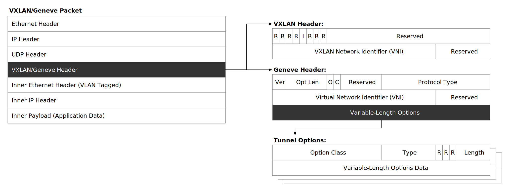
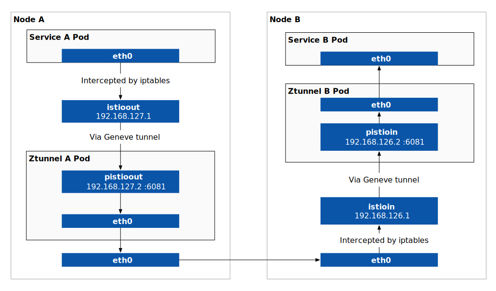

In a previous[ blog post](/en/blog/ambient-mesh-l7-traffic-path/), I discussed how Istio Ambient Mesh uses iptables and Geneve tunnels to intercept traffic from application pods into Ztunnel. Many readers may not be familiar with this tunneling protocol, so this article will introduce the definition, packet structure and advantages of Geneve tunnels compared with the VXLAN protocol. Finally, this article will introduce how Istio Ambient Mesh applies Geneve tunnels to implement traffic interception and the new eBPF mode introduced in Istio 1.18.

## Introduction to Geneve Tunnels

In order to address the lack of flexibility and security in current data transmissions, the Geneve (Generic Network Virtualization Encapsulation) network virtualization encapsulation (tunneling) protocol was created. Geneve only defines a data encapsulation format, excluding control plane information. The key advantage of Geneve over VXLAN encapsulation is that it extends the types of encapsulated protocols by adding TLV format options.

### Geneve vs. VXLAN

VXLAN and Geneve are both network virtualization protocols and they have many similarities. Virtualization protocols are technologies that separate virtual networks from physical networks. They allow network administrators to create multiple virtual networks in a virtual environment, each of which can have its own VLAN identifiers, IP addresses and routing. In addition, VXLAN and Geneve use UDP encapsulation, which enables them to be extended through existing network infrastructure. VXLAN and Geneve protocols are also flexible, can be used in different network topologies and are compatible with different virtualization platforms.

Figure 1 shows the message structure of VXLAN and Geneve tunnels and the differences in their respective headers.



From the figure, we can see that the message structure of VXLAN and Geneve tunneling protocols is similar, with the main difference being the use of different UDP port numbers and protocol headers. VXLAN uses port 4789, while Geneve uses port 6081. The Geneve protocol header is more extendable than VXLAN.

The Geneve tunneling protocol adds variable-length options that can contain zero or more option data in TLV format, making it more scalable than VXLAN. TLV stands for Type-Length-Value, which is a format for parsing and transmitting metadata in network packets. Each metadata information in the Geneve protocol is composed of a TLV format field, making it simple to flexibly add, delete and modify these metadata.

The TLV format field contains the following data:

- Type: 8-bit type field.
- Length: 5-bit option length field, represented in multiples of 4 bytes, excluding the option header.
- Data: Variable-length option data field, which may not exist or may be between 4 and 128 bytes.

The Geneve protocol can easily modify and extend metadata information while maintaining compatibility and flexibility by using the TLV format.

Please refer to[ RFC 7348 Virtual eXtensible Local Area Network (VXLAN): A Framework for Overlaying Virtualized Layer 2 Networks over Layer 3 Networks](https://tools.ietf.org/html/rfc7348) for more information about VXLAN. For more information about the Geneve tunnel packet format, please refer to[ RFC 8926 Geneve: Generic Network Virtualization Encapsulation](https://www.rfc-editor.org/rfc/rfc8926#name-geneve-packet-format-over-i).

### How it Works

The Geneve tunnel is mainly used in cloud computing and virtualization scenarios, and it can encapsulate packets in a new packet for transmission in a virtual network. The Geneve tunnel uses a 24-bit VNI (Virtual Network Identifier) to transmit packets from one physical network to another. The Geneve tunnel can also use security protocols such as IPsec and TLS to protect the transmission of packets.

When a packet reaches the destination host, the Geneve tunnel protocol will de-encapsulate the packet from the Geneve protocol header and deliver it to the destination in the virtual network. During the de-encapsulation process, the VNI information in the Geneve protocol header is used to determine the destination of the packet, ensuring that the packet is correctly routed to the destination in the virtual network.

Assuming there is a virtual network with a VNI of 1001. When a packet is transmitted from one physical network to another, a tunnel can be used to track the packet during transmission by setting the VNI between the source and target physical networks to 1001. When the packet reaches the target physical network, the VNI is removed from the packet and the packet is delivered to the target physical network.

### Security

The Geneve tunnel protocol itself does not provide any security mechanisms, so packets transmitted in the Geneve tunnel can be subject to threats such as packet tampering, interception and replay.

To ensure the security of packets transmitted in the Geneve tunnel, some security protocols can be used. The following are some common security protocols:

1. IPsec (Internet Protocol Security): IPsec is a network layer security protocol that can encrypt, authenticate and provide integrity protection to packets in the Geneve tunnel. IPsec can provide end-to-end security.
2. TLS (Transport Layer Security): TLS is an encryption protocol based on the transport layer that can encrypt and authenticate packets in the Geneve tunnel. TLS can provide end-to-end security.
3. MACSec (Media Access Control Security): MACSec is a data link layer security protocol that can encrypt and authenticate packets in the Geneve tunnel. MACSec can provide link-layer security.

It should be noted that the above security protocols require corresponding configuration and deployment and may have a certain impact on performance. When choosing the appropriate security protocol, factors such as security, performance, manageability and other aspects need to be considered.

## Why Choose Geneve?

The following table compares the characteristics of VXLAN and Geneve in multiple aspects.

| **Feature**   | **VXLAN**                          | **Geneve**                                   |
| ------------- | ---------------------------------- | -------------------------------------------- |
| Header format | Fixed format                       | Extensible format                            |
| Scalability   | More focused on L2 extension       | Better support for emerging network services |
| Operability   | Difficult to manage and extend     | Easier to manage and extend                  |
| Performance   | Shorter header, higher performance | Longer header, slightly lower performance    |

**Table 1:** *VXLAN vs Geneve characteristics*.

The main reason for using the Geneve protocol is to combine the advantages of current network virtualization encapsulation technologies (such as VXLAN, NVGRE and STT) into one protocol. Through years of network virtualization development experience, we know that one of the most important requirements is scalability. The Geneve protocol encodes metadata using an extensible TLV structure, so it can independently develop the functionality of software and hardware endpoints to meet growing needs.

## How Istio Ambient Mesh Applies Geneve Tunnels

In the[ previous blog](https://tetrate.io/blog/transparent-traffic-intercepting-and-routing-in-the-l4-network-of-istio-ambient-mesh/), I explained how Istio Ambient Mesh uses Ztunnel to implement L4 proxies and Figure 2 shows the L4 transparent traffic interception path using iptables and Geneve tunnels.


From the figure, we can see that:

- The Istio CNI creates an `istioout` network card and iptables rules on the node, transparently intercepting the outbound traffic in the node to the `pistioout` virtual network card.
- The Istio CNI creates an `istioin` network card and iptables rules on the node, transparently intercepting the inbound traffic in the node to the `pistioin` virtual network card.
- The Istio CNI creates `pistioin` and `pistioout` network cards in ztunnel to receive data packets in the Geneve tunnel.

The two network cards `pistioin` and `pistioout` are created by the init container or Istio CNI (see the `CreateRulesWithinNodeProxyNS` function in [net_linux.go](https://github.com/istio/istio/blob/master/cni/pkg/ambient/net_linux.go#L910)), and their IP addresses and ports are fixed. The data packets sent by the application container need to pass through the `istioout` network card and be forwarded to the ztunnel container after being encapsulated in the Geneve tunnel. When the data packets are received by the ztunnel container, they are de-encapsulated and forwarded to the corresponding application containers through the `pistioin` network card.

## Using eBPF for Transparent Traffic Interception

eBPF (extended Berkeley Packet Filter) is a powerful technology that allows secure user-space programs to run within the Linux kernel. Initially developed as a technique for filtering network packets, eBPF has now been extended to other areas such as tracking system calls, performance analysis and security monitoring. The advantages of eBPF are its lightweight nature, efficiency, security and programmability. It can be used in real-time monitoring, network security, application debugging and optimization, container networking and various other fields.

Istio Ambient Mesh also supports using the eBPF (extended Berkeley Packet Filter) mode for transparent traffic interception since 1.18. As shown in Figure 3, the eBPF program runs directly in the host kernel and forwards application traffic to ztunnel. Compared to the iptables-based approach, the eBPF mode can provide better network efficiency and scalability. However, it requires a higher version of the Linux kernel and is more difficult to implement.


To use the eBPF mode to run Ambient Mesh, simply set the `values.cni.ambient.redirectMode` parameter to “ebpf” when installing Istio, as shown below:

```bash
istioctl install --set profile=ambient --set values.cni.ambient.redirectMode="ebpf"
```

## Summary

This article introduced the working principle, security and comparison with VXLAN of the Geneve tunnel protocol. In addition, it also introduced how Istio Ambient Mesh uses Geneve tunnels to implement traffic interception and discussed the advantages and disadvantages of using eBPF for transparent traffic interception. The Geneve tunnel protocol is a universal tunneling protocol that can transmit packets in virtual networks, and it has more advantages than other tunneling protocols. Therefore, when choosing a tunneling protocol, users can consider using the Geneve tunnel. In Istio 1.18, the eBPF mode of Ambient Mesh is newly introduced, which can provide better network efficiency, but has higher requirements for the Linux kernel version. Users can choose according to their actual situation.

## References

- [RFC 7348 Virtual eXtensible Local Area Network (VXLAN): A Framework for Overlaying Virtualized Layer 2 Networks over Layer 3 Networks](https://tools.ietf.org/html/rfc7348)
- [RFC 8926 Geneve: Generic Network Virtualization Encapsulation](https://www.rfc-editor.org/rfc/rfc8926#name-geneve-packet-format-over-i)
- [Istio Ambient Mesh](https://istio.io/latest/docs/ops/deployment/architecture/#istio-ambient-mesh)
- [Open vSwitch Geneve(8) man page](https://www.mankier.com/8/ovs-vswitchd.conf.db(5))

---

If you’re new to service mesh and Kubernetes security, we have a bunch of free online courses [available at Tetrate Academy](https://tetr8.io/academy) that will quickly get you up to speed with Istio and Envoy.

If you’re looking for a fast way to get to production with Istio, check out [Tetrate Istio Distribution (TID)](https://tetr8.io/tid) . TID is Tetrate’s hardened, fully upstream Istio distribution, with FIPS-verified builds and support available. It’s a great way to get started with Istio knowing you have a trusted distribution to begin with, have an expert team supporting you, and also have the option to get to FIPS compliance quickly if you need to.Once you have Istio up and running, you will probably need simpler ways to manage and secure your services beyond what’s available in Istio, that’s where Tetrate Service Bridge comes in. You can learn more about how Tetrate Service Bridge makes service mesh more secure, manageable, and resilient [here](https://tetr8.io/tsb) , or [contact us for a quick demo](https://tetr8.io/contact) .

*This blog was originally published at [tetrate.io](https://tetrate.io/blog/using-geneve-tunnels-to-implement-istio-ambient-mesh-traffic-interception/).*
