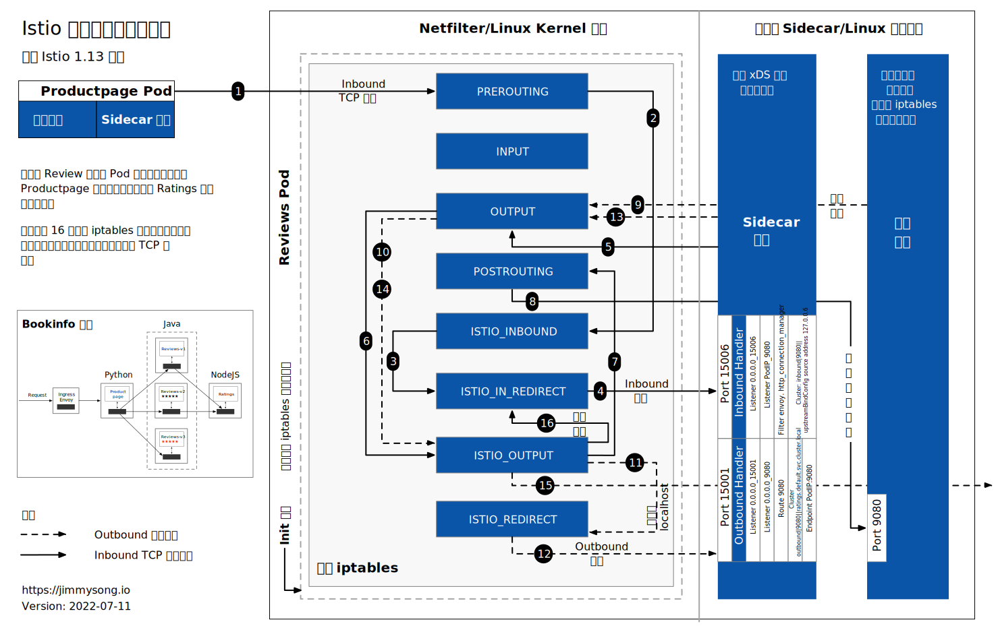
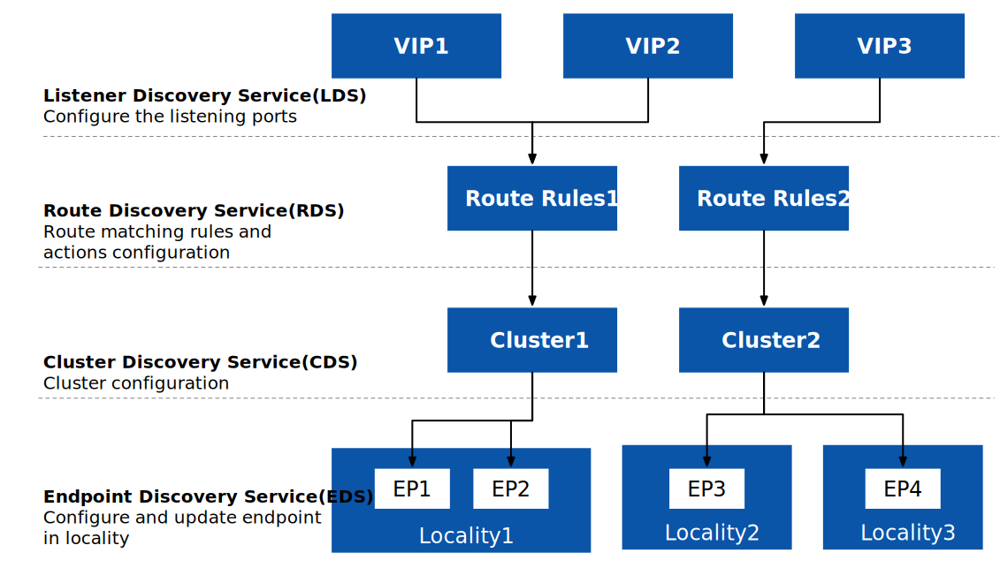
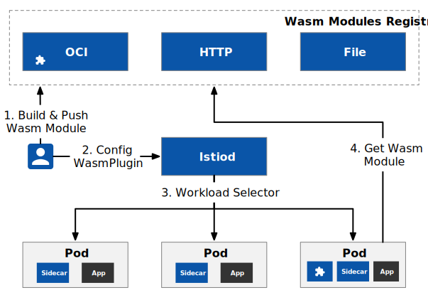
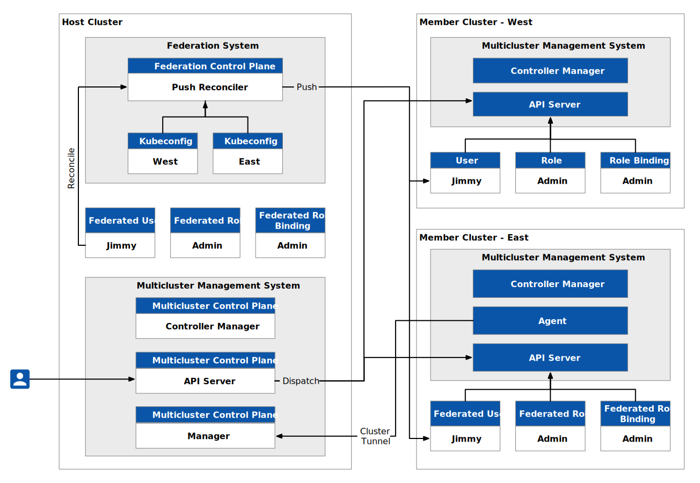


本文根据笔者在 GIAC 深圳 2022 年大会上的的演讲[《Beyond Istio OSS —— Istio 的现状及未来》](https://giac.msup.com.cn/2022sz/course?id=16093)整理而成。


本文回顾了 Istio 开源近五年来的发展，并展望了 Istio 的发展方向。本文中主要阐述的观点如下：

- 因为 Kubernetes、微服务、DevOps 及云原生架构的流行，导致服务网格技术的兴起；
- Kubernetes 和可编程代理的出现，为 Istio 的实现打好了技术基础；
- 虽然 eBPF 可以加速 Istio 中的透明流量劫持，但无法取代服务网格中的 sidecar；
- Istio 的未来是构建零信任网络；

接下来我们从 Istio 诞生的背景开始本文。

## Istio 诞生的前夜{#the-dawn-of-istio}

2013 年起，随着移动互联网的爆发，企业对应用迭代的效率要求更高，应用程序架构开始从单体转向微服务，DevOps 也开始变得流行。同年随着 Docker 的开源，解决了应用封装和隔离的问题，使得应用在编排系统中调度变得更容易。2014 年 Kubernetes、Spring Boot 开源，Spring 框架开发微服务应用开始流行，在接下来的几年间大批的 RPC 中间件开源项目出现，如 Google 在 2016 年发布 gRPC 1.0，蚂蚁在 2018 年开源 [SOFAStack](https://www.sofastack.tech/) 等，微服务框架百花齐放。为了节约成本，增加开发效率，使应用更具弹性，越来越多的企业正在迁移上云，但这不仅仅是将应用搬到云上那么简单，为了更高效地利用云计算，一套「云原生」方法和理念也呼之欲出。

## Istio 开源时间线{#istio-open-time-line}

Istio 开源发展时间线如下图所示。


下面我们来简单回顾下 Istio 开源大事件：

- 2016 年 9 月：因为 Envoy 是 Istio 中的重要组成，Istio 的开源时间线应该有 Envoy 一部分。起初 Envoy 在 Lyft 内部仅作为边缘代理，在 Envoy 开源之前已在 Lyft 内部得到大规模生产验证。其实在 Envoy 开源之前就已经得到开源之后得到了 Google 工程师的注意 [^1]，那时候 Google 正打算推出一个服务网格的开源项目，一开始还是打算使用 Nginx 作为代理！ 2017 年，Envoy 捐献给了 [CNCF](https://cncf.io)。
- 2017 年 5 月：Istio 由 Google、IBM 和 Lyft 联合宣布开源 [^2]。一开始就使用了微服务架构，确定了数据平面和控制平面的组成以及 Sidecar 模式。
- 2018 年 3 月：Kubernetes 顺利的成为从 CNCF 中第一个毕业的项目，变得越来越「无聊」，基础 API 已经定型，CNCF 正式将服务网格（Service Mesh）写入到了云原生的第二版定义 [^3] 中。当年笔者当前就职的公司，由 Google Istio 初创团队创立的 [Tetrate](https://tetrate.io) 成立了。服务网格在中国开始爆发，ServiceMesher 社区也在蚂蚁集团的支持下成立，在中国布道服务网格技术。
- 2018 年 7 月：Istio 1.0 发布，号称「生产可用」，Istio 团队重组。
- 2020 年 3 月：Istio 1.5 发布，架构回归单体，发布周期确定，每三个月发布一个大版本，API 趋于稳定。
- 2020 年至今：Istio 的发展主要着重于 Day 2 Operation [^4]、性能优化和扩展性发面，多个围绕 Istio 生态的开源项目开始出现，例如 [Slime](https://github.com/slime-io/slime/)、[Areaki](https://github.com/aeraki-mesh/aeraki)、[Merbridge](https://github.com/merbridge/merbridge)。

## 为什么 Istio 会在 Kubernetes 之后出现？{#why-istio-born-after-kubernetes}

这里所说的出现，指的是「服务网格」概念的诞生。微服务和容器化之后，异构语言使用的增加，服务的数量激增，容器的生命周期变短是导致服务网格出现的根本原因。

为了使开发者最小成本地管理服务间的流量成为可能，Istio 需要解决三个问题：

1. 透明流量劫持应用间的流量，这一点对于开发者来说就意味着不需要修改应用程序就可以快速使用 Istio 带来的能力；
1. 另一点是运维层面，如何为每个应用注入一个代理，同时高效地管理这些分布式的 sidecar 代理；
1. 一个可以通过 API 配置的，高效可扩展的 sidecar 代理；

以上三个条件对于 Istio 服务网格来说缺一不可，而且，从中我们可以看到，这些要求基本都是对于 sidecar 代理的要求，这个代理的选择将直接影响该项目的走向与成败。

为了解决以上三个问题，Istio 选择了

1.  容器编排调度平台：Kubernetes
1.  可编程代理：Envoy

从下图中我们可以看到服务从 Kubernetes 到 Istio 部署架构的变迁，其中有诸多变与不变。


从 Kubernetes 到 Istio，概括的讲应用的部署架构有如下特点：

- Kubernetes 管理应用的生命周期，具体来说，就是应用的部署和管理（扩缩容、自动恢复、发布策略）。
- 基于 Kubernetes 的自动 sidecar 注入，实现了透明流量拦截。先通过 sidecar 代理拦截到微服务间流量，再通过控制平面配置管理微服务的行为。如今服务网格的部署模式也迎来了新的挑战，sidecar 已经不是 Istio 服务网格所必须的，基于 gRPC 的无代理的服务网格 [^5] 也在测试中。

- 服务网格将流量管理从 Kubernetes 中解耦，服务网格内部的流量无须 kube-proxy 组件的支持， 通过接近微服务应用层的抽象，管理服务间的流量，实现安全性和可观察性功能。
- 控制平面通过 xDS 协议发放代理配置给数据平面，已实现 xDS 的代理有 [Envoy](https://envoyproxy.io) 和蚂蚁开源的 [MOSN](https://mosn.io)。

- Kubernetes 集群外部的客户端访问集群内部服务时，原先是通过 Kubernetes [Ingress](https://lib.jimmysong.io/kubernetes-handbook/concepts/ingress/)，在有了 Istio 之后，会通过 Gateway 来访问 [^6]。

### 透明流量劫持{#traffic-intercept}

如果你使用的是如 gRPC 这类中间件开发微服务，在程序中集成 SDK 后，SDK 中的拦截器会自动为你拦截流量，如下图所示。


如何让 Kubernetes  pod 中的流量都通过代理呢？答案是在每个应用程序 pod 中注入一个代理，与应用共享网络空间，再通过修改 pod 内的流量路径，让所有进出 pod 的流量都经过 sidecar，其架构如下图所示。



从图中我们可以看到其中有一套非常复杂的 iptables 流量劫持逻辑，使用 iptables 的好处是适用于任何 Linux 操作系统。但是这也带来了一些副作用：

1. Istio 网格中所有的服务都需要在进出 pod 时都增加了一个网络跳跃点（hop），虽然每次 hop 可能只有两三毫秒，但是随着网格中服务和服务间的依赖增加，这种延迟可能会显著增加，对于那种追求低延迟的服务可能就不适用于服务网格了；
2. 因为 Istio 向数据平面中注入了大量的 sidecar，尤其是当服务数量增大时，控制平面需要下发更多的 Envoy 代理配置到数据平面，这样会使数据平面占用大量的系统内存和网络资源；

针对这两个问题，如何优化服务网格呢？

1. 使用 proxyless 模式：取消 sidecar 代理，重新回到 SDK；
2. 优化数据平面：减少下发到数据平面的配置的频率和大小；
3. eBPF：使用 eBPF 优化网络劫持；

本文将在后面[性能优化](#performance-optimizing)一节讲解这些细节。

### Sidecar 运维管理{#sidecar-management}

Istio 是在 Kubernetes 的基础上构建的，它可以利用 Kubernetes 的容器编排和生命周期管理，在 Kubernetes 创建 pod 时，通过准入控制器自动向 pod 中注入 sidecar。下图展示了

为了解决 Sidecar 的资源消耗问题，有人为服务网格提出了有四种部署模式，如下图所示。


下表中详细对比了这四种部署方式，它们各有优劣，具体选择哪种根据实际情况而定。


| **模式**                           | **内存开销**                                                 | **安全性**                                                   | **故障域**                                                   | **运维**                                                  |
| :--------------------------------- | :----------------------------------------------------------- | :----------------------------------------------------------- | :----------------------------------------------------------- | :-------------------------------------------------------- |
| **Sidecar 代理**                   | 因为为每个 pod 都注入一个代理，所以开销最大。                | 由于 sidecar 必须与工作负载一起部署，工作负载有可能绕过 sidecar。 | Pod 级别隔离，如果有代理出现故障，只影响到 Pod 中的工作负载。 | 可以单独升级某个工作负载的 sidecar 而不影响其他工作负载。 |
| **节点共享代理**                   | 每个节点上只有一个代理，为该节点上的所有工作负载所共享，开销小。 | 对加密内容和私钥的管理存在安全隐患。                         | 节点级别隔离，如果共享代理升级时出现版本冲突、配置冲突或扩展不兼容等问题，则可能会影响该节点上的所有工作负载。 | 不需要考虑注入 Sidecar 的问题。                           |
| **Service Account / 节点共享代理** | 服务账户 / 身份下的所有工作负载都使用共享代理，开销小。      | 工作负载和代理之间的连接的认证及安全性无法保障。             | 节点和服务账号之间级别隔离，故障同 “节点共享代理”。          | 同 “节点共享代理”。                                       |
| **带有微代理的共享远程代理**       | 因为为每个 pod 都注入一个微代理，开销比较大。                | 微代理专门处理 mTLS，不负责 L7 路由，可以保障安全性。        | 当需要应用 7 层策略时，工作负载实例的流量会被重定向到 L7 代理上，若不需要，则可以直接绕过。该 L7 代理可以采用共享节点代理、每个服务账户代理，或者远程代理的方式运行。 | 同 “Sidecar 代理”。                                       |



### 可编程代理{#programmable-proxy}

Flomesh 的张晓辉曾在 [为什么需要可编程代理](https://cloudnative.to/blog/what-and-why-programmable-proxy/) 博客中详细说明了代理软件的发展演化过程，我下面将引用他的一些观点，说明可编程代理 Envoy 在 Istio 中的关键作用。

下图展示了代理软件从配置到可编程模式的演化过程，及每个阶段中的代表性代理软件。



整个代理演化过程都是随着应用从本地和单体，越来越走向大规模和分布式。下面我将简要概括代理软件的发展过程：

- **配置文件时代**：几乎所有软件都有配置文件，代理软件因为其相对复杂的功能，更离不开配置文件。该阶段的代理主要使用 C 语言开发，包括其扩展模块，突出的代理本身的能力。这也是我们使用代理最原始最基础的形式，这些代理包括 Nginx、Apache HTTP Server、[Squid](http://www.squid-cache.org/) 等；
- **配置语言时代**：这个时代的代理，更具扩展性和灵活性，比如动态数据获取和配套的逻辑判断。代表性软件包括扩 [Varnish](https://varnish-cache.org/) 和 HAProxy；
- **脚本语言时代**：从脚本语言的引入开始，代理软件才真正走向的可编程，我们可以更方便的使用脚本在代理中增加动态逻辑，增加了开发效率。代表性的软件是 Nginx 及其支持的脚本语言；
- **集群时代**：随着云计算的普及，大规模部署和动态配置 API 成了代理所必需的能力，而且随着网络流量的增加，大规模代理集群也应运而生。这个时代的代表性代理软件有 Envoy、Kong 等；
- **云原生时代**：多租户、弹性、异构混合云、多集群、安全和可观测，这些都是云原生时代对代理所提出的更高要求。这也会服务网格的历史机遇，代表性软件有 Istio、Linkerd、[Pypi](https://flomesh.io/)。

## 这些都是服务网格吗？{#are-they-service-mesh}

那么，有了代理就可以构建服务网格了吗？现在我将列举现有的服务网格项目，我们一起探索服务网格的发展规律和本质。下表对比了当前流行的开源的「服务网格」项目 [^7]。



| 对比项     | Istio                                                    | Linkerd                                                     | Consul Connect                                               | Traefik Mesh                                                 | Kuma                                | Open Service Mesh (OSM)             |
| :--------- | :------------------------------------------------------- | :---------------------------------------------------------- | :----------------------------------------------------------- | :----------------------------------------------------------- | :---------------------------------- | ----------------------------------- |
| 当前版本   | 1.14                                                     | 2.11                                                        | 1.12                                                         | 1.4                                                          | 1.5                                 | 1.0                                 |
| 许可证     | Apache License 2.0                                       | Apache License 2.0                                          | Mozilla License                                              | Apache License 2.0                                           | Apache License 2.0                  | Apache License 2.0                  |
| 发起者     | Google、IBM、Lyft                                        | Buoyant                                                     | HashiCorp                                                    | Traefik Labs                                                 | Kong                                | Microsoft                           |
| 服务代理   | Envoy，支持 gRPC 的 proxyless 模式                       | [Linkerd2-proxy](https://github.com/linkerd/linkerd2-proxy) | 默认为 [Envoy](https://www.envoyproxy.io/)，可替换           | [Traefik Proxy](https://traefik.io/traefik/)                 | [Envoy](https://www.envoyproxy.io/) | [Envoy](https://www.envoyproxy.io/) |
| 入口控制器 | Envoy，自定义的 Ingress，支持 Kubernetes  Gateway API    | 无内置                                                      | Envoy，支持 Kubernetes Gateway API                           | 无内置                                                       | Kong                                | 支持 Contour、Nginx，兼容其他       |
| 治理       | Istio Community 和 Open Usage Commons，已提议捐献给 CNCF | CNCF                                                        | 查看 [贡献指南](https://github.com/hashicorp/consul/blob/master/.github/CONTRIBUTING.md) | 查看 [贡献指南](https://github.com/traefik/mesh/blob/master/CONTRIBUTING.md) | CNCF                                | CNCF                                |



下面总结一下上表中的开源项目，同时追加几个与服务网格息息相关的项目，如下：

- [Istio](https://istio.io)：目前最流行的服务网格项目之一，在中国几乎成为了服务网格的代名词；
- [Envoy](https://envoyproxy.io)：Envoy 本身只是代理，也经常被作为其他基于 Envoy 的服务网格的 sidecar，也经常被用来构建 API Gateway；
- [Linkerd](https://linkerd.io)：最早出现的服务网格，「Service Mesh」概念提出者，第一个进入 CNCF 的服务网格项目，使用自研的 Rust 语言编写轻量级 sidecar 代理；
- [Traefik Mesh](https://traefik.io/traefik-mesh/)：由 Traefik 推出的服务网格项目，使用 Treafik proxy 作为 sidecar，支持 SMI（接下来会提到），它的特点是对应用的无侵入性，不会在 pod 中注入 sidecar，
- [Kuma](https://kuma.io/)：由 Kong 推出的服务网格项目，使用 Envoy 作为 Sidecar 代理，特色是使用 Kong 自家的
- [Consul Connect](https://www.consul.io/docs/connect)：Consul 服务网格，使用 Envoy 作为 sidecar 代理；
- [Open Service Mesh](https://openservicemesh.io/)：由微软开源的服务网格，使用 Envoy 作为 sidecar，兼容 SMI（同样是微软提出）。
- [Service Mesh Performance（SMP）](https://smp-spec.io/)：标准化了服务网格值的指标，通过捕获基础设施容量、服务网格配置和工作负载元数据的细节来描述任何部署的性能；
- [Service Mesh Interface（SMI）](https://smi-spec.io/)：它不是服务网格，而只是一套服务网格实现标准，与 OAM、SPIFFE、CNI、CSI 等类似都是定义接口标准，具体实现就不一而足了。目前 Traefik Mesh 和 Open Service Mesh 声明支持该规范。
- [Network Service Mesh](https://networkservicemesh.io/)：有必要提一下这个项目，因为经常有人把它错认为是一个服务网格。实际上，它面向的是三层网络，使用它可以在不更换 CNI 插件的前提下，连接多云/混合云。它并不是我们所定义的「服务网格」，而是服务网格的一个有力补充（虽然名字里带有服务网格比较有迷惑性）。

纵观以上所谓的「服务网格」项目，我们可以看出大部分服务网格项目的发起者都是根据代理起家，然后做控制平面。而且 Istio、Consul Connect、Open Service Mesh、Kuma 都是使用 Envoy 作为 sidecar 代理。只有 Linkerd 和 Traefik Mesh 推出了自己的代理。而所有的服务网格项目都支持 sidecar 模式。除了 Istio、Linkerd、Consul Connect 已应用于生产上，其他服务网格项目目前还只能算是个「玩具」。

## Istio 的性能优化{#performance-optimizing}

在 Istio 1.5 版本确定了稳定的架构之后，社区的主要精力在于优化 Istio 的性能。下面我将向你详细介绍 Istio 中的性能优化方法，包括：

- 采用 Proxyless 模式；
- 使用 eBPF 优化流量劫持；
- 控制平面性能优化；
- 数据平面性能优化；

### Proxyless 模式{#proxyless-pattern}

Proxyless 模式是 Istio 在 1.11 版本中提出的实验特性 —— [基于 gRPC 和 Istio 的无 sidecar 代理的服务网格](https://lib.jimmysong.io/translation/grpc-proxyless-service-mesh/)。使用该模式可以直接将 gRPC 服务添加到 Istio 中，而不需要再向 Pod 中注入 Envoy 代理。下图展示了 sidecar 模式与 proxyless 模式的对比图。



从上图中我们可以看到，虽然 proxyless 模式不使用 proxy 进行数据面通信，但仍然需要一个 agent 来进行初始化和与控制面的通信。首先，agent 在启动时生成一个[引导文件](https://github.com/grpc/proposal/blob/master/A27-xds-global-load-balancing.md#xdsclient-and-bootstrap-file)，与为 Envoy 生成引导文件的方式相同。这告诉 gRPC 库如何连接到 istiod，在哪里可以找到用于数据平面通信的证书，向控制面发送什么元数据。接下来，agent 作为 xDS proxy，代表应用程序与 `istiod` 进行连接和认证。最后，agent 获取并轮换数据平面通信中使用的证书。

> *服务网格的本质不是 Sidecar 模式，也不是配置中心或透明流量拦截，而是标准化的服务间通信标准。*

有人说 proxyless 模式又回到了基于 SDK 开发微服务的老路，服务网格的优势丧失殆尽，那还能叫做服务网格吗 [^9]？其实这也是一种对性能的妥协 —— 如果你主要使用 gRPC 来开发微服务的话，只需要维护不同语言的 gRPC 版本，即可以通过控制平面来管理微服务了。

> *Envoy xDS 已经成为云原生应用服务间通信的事实标准。*



### 使用 eBPF 优化流量劫持{#ebpf}

在[透明流量劫持](#traffic-intercept)一节，我们可以看到一个服务间的流量在到达目的地 pod 时经过的 iptables 规则和路径，其中需要经过多条 iptables 规则，如 `PREROUTING`、`ISTIO_INBOUND`、`ISTIO_IN_REDIRECT`、`OUTPUT`、`ISTIO_OUTPUT`、`POSTROUTING` 等。假设现在有一个服务 A 想要调用非本地主机上的另一个 pod 中的服务 B，经过的网络堆栈如下图所示。


从图中我们可以看到整个调用流程中经过四次 iptables，其中 Pod A 中的从 Envoy 的出站（iptables2）和 Pod B 中的从 eth0 的入站（iptables3）的 iptables 路由是无法避免的，那么剩下的两个 iptables1 和 iptables4 是否可以优化呢？让两个 socket 直接通信，不就可以缩短网络路径了吗？这就需要通过 eBPF 编程，使得：

- Service A 的流量从直接发送到 Envoy 的 Inbound socket 上；
- Pod B 中 Envoy 接收到入站流量后，已经确定流量是要发送给本地的服务，直接对接 Outbound socket 与 Service B；

使用 eBPF 模式的透明流量拦截网络路径如下图所示。


如果要访问的服务 A 和服务 B 在同一个节点上，那么网络路径将更短。


同一个节点中的服务间访问完全绕过了 TCP/IP 堆栈，变成了 socket 间的直接访问。



我们知道修改 Linux 内核代码很难，新特性发布到内核中需要很长的周期。eBPF 是一个框架，允许用户在操作系统的内核内加载和运行自定义程序。也就是说，有了 eBPF，你不需要直接修改内核，就可以扩展和改变内核的行为。下面我将简要的为大家介绍一下 eBPF：

- eBPF 程序加载到内核中后需要通过验证器的验证才可以运行，验证器可以防止 eBPF 程序超越权限的访问，这样可以确保内核的安全；
- eBPF 程序是附着于内核事件上的，当有进入或退出内核函数时被触发；
- 内核空间的 eBPF 程序必须使用能够支持生成 eBPF 字节码格式的编译器的语言编写，目前你可以用 C 和 Rust 语言编写 eBPF 程序；
- eBPF 程序对于不同的 Linux 版本存在兼容性问题；

由于 eBPF 程序可以直接监听和操作 Linux 内核，具有对系统最底层的透视，就可以在流量管理、可观测性和安全发挥作用。有关 eBPF 的详细介绍请参考笔者翻译的[《什么是 eBPF》](https://lib.jimmysong.io/what-is-ebpf/)电子书。



开源项目 [Merbridge](https://github.com/merbridge/merbridge) 正是利用 eBPF 缩短了透明流量劫持的路径，优化了服务网格的性能。关于 Merbridge 实现的一些细节，请参考 [Istio 博客](https://istio.io/latest/zh/blog/2022/merbridge/)。



Merbridge 使用的 eBPF 函数需要 Linux 内核版本 ≥ 5.7。



乍看上去 eBPF 似乎从更底层实现了 Istio 的功能，更大有取代 sidecar 的趋势。但是 eBPF 也存在很多局限性，导致在可以预见的未来无法取代服务网格和 Sidecar。如果取消 sidecar 转而使用每个主机一个代理的模式，会导致：

1. 代理失败的爆炸半径扩大到整个节点；
2. 使得安全问题更加复杂，因为一个节点上保存在太多负载的证书，一旦被攻击，会存在秘钥泄露的风险；
3. 主机上的 Pod 之间的流量争抢问题；

而且 eBPF 主要负责三/四层流量，可以与 CNI 一起运行，但是七层流量使用 eBPF 来处理就不太合适了。

> 在可以预见的未来 eBPF 技术无法取代服务网格和 Sidecar。

关于 eBPF 与服务网格的关系的更详细介绍请参考博客[请暂时抛弃使用 eBPF 取代服务网格和 Sidecar 模式的幻想](/blog/ebpf-sidecar-and-service-mesh/)。

### 控制平面性能优化{#control-plane-perf-optimizing}

以上两种优化都是针对数据平面进行的，我们再来看下控制平面的性能优化。你可以把服务网格想象成是一场演出，控制平面是总导演，数据平面是所有演员，导演不参与演出，但是负责指挥演员。如果这场演出的情节很简单，时长又很短，那要每个演员分配的戏份就会很少，排练起来就会很容易；如果是一个大型演出，演员的数量多，情节有很复杂，要想排练好这场演出，一个导演可能是不够的，他指挥不了这么多演员，因此我们需要多名副导演（扩大控制平面实例数量）；我们还需要给演员准备好台词和脚本，如果演员也可以一个镜头完成一连串的台词和场景的表演（减少都数据平面的打扰，批量推送更新），那我们的排练是不是更加高效？

从上面的类比中，你应该可以找到控制平面性能优化的方向了，那就是：

- 减少需要推送的配置大小；
- 批处理代理推送；
- 扩大控制平面规模；

#### 减少需要推送的配置{#reduce-config-size}

优化控制平面性能最简单也是最直接的方式就是减少要推送的配置大小。假设有工作负载 A，如果将与 A 相关的代理配置，即 A 需要访问的服务的配置推送到 A 上，而不是将网格内所有服务的配置都推送给 A，这样就可以大大压缩要推送的配置的大小及应用范围。Istio 中的 [Sidecar 资源](https://lib.jimmysong.io/istio-handbook/config-networking/sidecar/)可以帮助我们实现这一点。下面是 Sidecar 配置示例：

```yaml
apiVersion: networking.istio.io/v1alpha3
kind: Sidecar
metadata:
  name: default
  namespace: cn-bj
spec:
  workloadSelector:
    labels:
      app: app-a
  egress:
  - hosts:
    - "cn-bj/*"
```

我们通过 `workloadSelector` 字段可以限制该 Sidecar 配置适用的工作负载范围，而 `egress` 字段可以确定该工作负载以来的服务范围，这样控制平面就可以仅向服务 A 推送其依的赖服务配置，大大减低要向数据平面推送的配置大小，减少了服务网格的内存和网络消耗。

#### 批处理代理配置推送{#batch-push-conf}

控制平面 Istiod 向数据平面推送代理配置的过程比较复杂，下图展示了其中的流程。


管理员配置 Istio 网格后，Istiod 中推送代理配置的流程是这样的：

1. 管理员更新配置的事件会触发数据平面的配置同步；
2. Istio 的 `DiscoveryServer` 组件监听到这些事件后不会立即将配置推送到数据平面，而是将这些事件添加到队列中，持续合并一段时间内的事件，这个过程叫做去抖动（debouncing），就是为了防止频繁的更新数据平面配置；
3. 在去抖动周期过后，这些事件将被推送到队列中；
4. Istiod 会限制同时推送的请求数量，以加快推送进度；
5. 事件被转换成 Envoy 的配置推送的数据平面的工作负载上；

从以上流程中我们可以看出，优化配置推送的关键就是步骤 2 中去抖动周期和步骤 4 中的限流设置。有这样几个环境变量可以帮助你设置控制平面的推送：

- `PILOT_DEBOUNCE_AFTER`：指定去抖动的时间，将事件添加到推送队列中。
- `PILOT_DEBOUNCE_MAX`：指定允许事件去抖动的最长时间。
- `PILOT_ENABLE_EDS_DEBOUNCE`：指定端点更新是否符合去抖动规则或具有优先权并立即落入推送队列。
- `PILOT_PUSH_THROTTLE`：指定同时处理的推送请求。

关于这些环境变量的默认值和具体配置请参考 [Istio 文档](https://istio.io/latest/docs/reference/commands/pilot-agent/#envvars)。

这些值究竟如何设置，可以遵循以下原则：

- 如果控制平面资源空闲，为了加快配置更新的传播速度，你可以：
  - 缩短去抖动周期，增加推送次数；
  - 增加同时处理的推送请求数量；
- 如果控制平面饱和，为了降低性能瓶颈，你可以：
  - 延迟去抖动周期，减少推送次数；
  - 增加同时处理的推送请求的数量；

至于如何设置最优解，需要结合你的可观测系统来调试。

#### 扩大控制平面规模{#scale-up-control-plane}

如果设置去抖动批处理和 Sidecar 还无法优化控制平面性能的话，最后的选择就是扩大控制平面的规模，包括扩大单个 Istiod 实例的资源和增加 Istiod 的实例个数，究竟采用哪种扩展方式视情况而定：

- 当单个 Istiod 的资源占用饱和时，优先推荐你扩大 Istiod 的实例大小，这通常是因为服务网格中有太多的资源（Istio 的自定义资源，如 VirtualService、DestinationRule 等）需要处理；
- 然后增加 Istiod 的实例个数，这样可以分散个实例要管理的工作负载数量；

### 数据平面性能优化{#data-plane-performance}

Apache SkyWalking 可以作为 Istio 提供可观测性工具，还可以帮助我们在进行服务动态调试和故障排除剖析服务的性能，其最新推出的 [Apache SkyWalking Rover](https://github.com/apache/skywalking-rover) 组件可以利用 eBPF 技术来准确定位 Istio 的关键性能问题 [^12]。

在数据平面，我们可以通过以下方式来增加 Envoy 的吞吐量以优化 Istio 的性能：

- 禁用 Zipkin 追踪或减少采样率
- 简化访问日志格式
- 禁用 Envoy 的访问日志服务（ALS）

以上优化方式对 Envoy 吞吐量的影响数据请参阅 [使用 eBPF 准确定位服务网格的关键性能问题](https://lib.jimmysong.io/blog/pinpoint-service-mesh-critical-performance-impact-by-using-ebpf/#introducing-skywalking-rover)。

## 服务网格的领衔主演  Envoy{#starring-envoy}

我们知道服务网格是由数据平面和控制平面组成的，从上面的服务网格开源项目列表中我们可以看到，服务网格开源项目大部分都是基于 Envoy，然后开发自己的控制平面。还记得我在本文前面将服务网格比作演出吗？在这场服务网格的演出中，毫无以为 Envoy 就是领衔主演 —— Envoy 发明的 xDS 协议，基本成为服务网格的通用 API，众多的服务网格开源项目都使用 Envoy 作为数据平面。下面展示的是 Envoy 的架构图。


xDS 是 Envoy 区别于其他代理的核心，因为它的代码和解析流程十分复杂 [^10]，扩展起来也很有难度。下面展示的是 Istio 组件拓扑图，从图中我们可以看到 Istio 数据平面的 Sidecar 容器中不止有 `envoy` 这一个进程，还有一个 `pilot-agent` 进程。



`pilot-agent` 进程的作用如下：
- 作为 `envoy` 的父进程，负责 Envoy 的生命周期管理；
-  接收来自控制平面的推送，配置代理和证书；
- 收集 Envoy 统计信息，汇总 sidecar 的统计数据供 Prometheus 搜集；
- 内置本地 DNS 代理，用于解析 Kubernetes DNS 解析不了的集群内部域名的场景；
- 对 Envoy 和 DNS 代理进行健康检查；

从以上功能中我们可以看出 `pilot-agent` 进程主要是用于与 Istiod 交互，为 Envoy 起到指挥和辅助的作用，Istio 的核心组件是 Envoy。那么 Envoy 会不会「演而优则导」，不再配合 Istio，构建一套自己的控制平面呢？

> *在 Sidecar 容器中，`pilot-agent` 就像是 Envoy 的  “Sidecar”。*


`pilot-agent` 的功能能否直接内置到 Envoy 中，从而取消 `pilot-agent` 呢？


## Envoy Gateway 统一服务网格网关{#envoy-gateway}

在 Kubernetes 中，除 Service 资源对象之外，最早用来暴露集群中服务的资源对象是 Ingress。使用 Ingress 你只需要为集群开放一个对外的访问点即可，通过 HTTP Hosts 和 `path` 来路由流量到具体的服务。相对于直接在 `service` 资源上暴露服务来说，可以减少集群的网络访问点（PEP）[^11] ，降低集群被网络攻击的风险。使用 Ingress 访问集群内的服务流程如下图所示。


在 Kubernetes 之前，API Gateway 软件就已经被广泛用作边缘路由了，在引用 Istio 时又增加了 Istio 自定义的 Gateway 资源，使得访问 Istio 服务网格中的资源又多了一种选择，如下图所示。


现在，要想暴露单个 Istio 网格中的服务，`NodePort`、`LoadBalance`、Istio 自定义 Gateway、Kubernetes Ingress 和 API Gateway 软件，如何选择？如果是多集群服务网格，客户端如何访问网格内的服务？我们的服务网格领衔主演 Envoy 已经在这方面做足了功夫，被以多种形式使用：

- Sidecar Proxy：正如在[前文中](#are-they-service-mesh)提到的，Istio、Kuma、Consul Connect 都使用了 Envoy 作为 sidecar 代理；
- Kubernetes Ingress Controller/API Gateway：[Contour](https://github.com/projectcontour/contour)、[Emissary](https://github.com/emissary-ingress/emissary)、[Hango](https://github.com/hango-io/hango-gateway)、[Gloo](https://github.com/solo-io/gloo)；

这些项目利用 Envoy 来实现服务网格和 API 网关，其中有很多功能重叠，同时又有很多专有功能，或者缺乏社区多样性，这种现状由于 Envoy 社区没有提供控制平面实现而导致的。为了改变现状，Envoy 社区发起了 [Envoy Gateway](https://github.com/envoyproxy/gateway) 项目，它不会更改 Envoy 核心代理、xDS 和 [go-control-plane](https://github.com/envoyproxy/go-control-plane)，该项目旨在结合现有的基于 Envoy 的 API Gateway 相关项目的经验 [^13]，利用带有一些 Envoy 特定扩展的  [Kubernetes Gateway API](https://gateway-api.sigs.k8s.io/) 降低 Envoy 用户使用网关的门槛。因为 Envoy Gateway 仍然通过 xDS 下发配置给 Envoy 代理，因此你还可以用它来管理支持 xDS 的网关，如 Istio Gateway。

我们现在所见的网关基本都是在单集群中作为入口网关，对于多集群和多网格就无能为力了。为了应对多集群，我们需要在 Istio 之上再添加一层网关，和一个全局的控制平面以在多集群间路由流量，如下图所示。



- 一级网关（下文简称 T1）位于应用边缘，用于多集群环境。同一应用会同时托管在不同的集群上，T1 网关将对该应用的请求流量在这些集群之间路由。
- 二级网关（下文简称 T2）位于一个的集群边缘，用于将流量路由到该集群内由服务网格管理的服务。


通过在 Istio 控制平面以外增加一层全局控制平面和 API，来实现多集群服务网格管理。将 T1 网关部署为集群，可以防止单点故障。想要了解关于两级网关的更多内容，请参考[通过两级网关设计来路由服务网格流量](https://lib.jimmysong.io/blog/designing-traffic-flow-via-tier1-and-tier2-ingress-gateways/)。

T1 网关的配置如下所示：

```yaml
apiVersion: gateway.tsb.tetrate.io/v2
kind: Tier1Gateway
metadata:
  name: service1-tier1
  group: demo-gw-group
  organization: demo-org
  tenant: demo-tenant
  workspace: demo-ws
spec:
  workloadSelector:
    namespace: t1
    labels:
      app: gateway-t1
      istio: ingressgateway
  externalServers:
  - name: service1
    hostname: servicea.example.com
    port: 80
    tls: {}
    clusters:
    - name: cluster1
      weight: 75
    - name: cluster2
      weight: 25 
```

该配置将 `servicea.example.com` 同过 T1 网关暴露到网格外，并将网格外访问该服务的流量的 `75%` 转发到 `cluster1`，`25%` 的流量转发到 `cluster2`，另外为了应对多集群中的流量、服务和安全配置，Tetrate 旗舰产品 Tetrate Service Bridge 中还增加了 一系列 Group API，详见 [TSB 文档](https://docs.tetrate.io/service-bridge/1.4.x)。

## Istio 开源生态{#ecosystem}

Istio 开源在至今已经五年多了，近两年来出现了很多开源项目，其中比较代表性的有：

- 网易开源的 Slime
- 腾讯开源的 Aeraki
- Istio 官方对 Wasm 插件的支持

它们的出现使得 Istio 更加智能化并扩展了 Istio 的适用范围。

### Slime

Slime 是由网易数帆微服务团队开源的一款基于 Istio 的智能网格管理器。Slime 基于 Kubernetes Operator 实现，可作为 Istio 的 CRD 管理器，无须对 Istio 做任何定制化改造，就可以定义动态的服务治理策略，从而达到自动便捷使用 Istio 和 Envoy 高阶功能的目的。

我们在前文的[控制平面性能优化](#control-plane-perf-optimizing)中提到了通过「减少需要推送的配置」的方式来优化 Istio 的性能，但是 Istio 无法做到自动识别无法依赖以最优化需要推送到每个 sidecar 的代理配置，Slime 提供了 `lazyload` 控制器，可以帮助我们实现配置懒加载，用户无须手动配置 `SidecarScope` [^15]，Istio 可以按需加载服务配置和服务发现信息。

下图展示的是 Slime 作为 Istio 的管理平面更新数据平面配置的流程图。


数据平面配置更新的具体步骤如下：

1. Slime Operator 根据管理员的配置在 Kubernetes 中完成 Slime 组件的初始化；
2. 开发者创建符合 Slime CRD 规范的配置并应用到 Kubernetes 集群中；
3. Slime 查询 Prometheus 中保存的相关服务的监控数据，结合 Slime CRD 中自适应部分的配置，将 Slime CRD 转换为 Istio CRD，同时将其推送到 Global Proxy 中；
4. Istio 监听 Istio CRD 的创建；
5. Istio 将 Sidecar Proxy 的配置信息推送到数据平面相应的 Sidecar Proxy 中；

因为数据平面中的所有服务的首次调用都通过 Global Proxy，该 Proxy 可以记录所有服务的调用和依赖信息，根据该依赖信息更新 Istio 中 Sidecar 资源的配置；当某个服务的调用链被 VirtualService 中的路由信息重新定义时， Global Proxy 原有记录就失效了，需要一个新的数据结构来维护该服务的调用关系。Slime 创建了名为 `ServiceFence` 的 CRD 来维护服务调用关系以解决服务信息缺失问题。关于 Slime 的更多信息请查看 [云原生资料库](https://lib.jimmysong.io/istio-handbook/ecosystem/slime/)。

### Aeraki

Aeraki Mesh 是腾讯云在 2021 年 3 月开源的一个服务网格领域的项目，基于 Istio 扩展对七层协议的支持，专注于解决 Istio 中的**非 HTTP 协议**的服务治理，已于 2022 年 6 月进入 CNCF Sandbox。

下图展示了 Aeraki 的架构图。



使用 Aeraki 将非 HTTP 服务到 Istio 网格中的流程如下：

1. Aeraki 的 X2Istio 组件对接服务注册中心，获取非 HTTP 服务的注册信息，并生成 ServiceEntry 向 Istio 中注册；
2. Aeraki 作为 Istio 之上的管理平面，它从 Istio 中获取 ServiceEntry 配置；
3. Aeraki 通过端口命令规判断服务的协议类型（如 `tcp-metaprotocol-dubbo`），然后生成 MetaProtocol Proxy Filter（兼容 EnvoyFilter）配置，同时修改 RDS 地址，将其指向 Aeraki；
4. Istio 使用 xDS 协议将配置（LDS、CDS、EDS 等）下发给数据平面；
5. Aeraki 根据服务注册表中的信息和用户设置生成路由规则，通过 RDS 发送给数据平面；

在 Istio 中接入非 HTTP 服务的整个流程中的关键是 **MetaProtocol Proxy** 。Istio 默认支持 HTTP/HTTP2、TCP 和 gRPC 协议，实验性支持 Mongo、MySQL 和 Redis 协议 [^14]。若要使用 Istio 路由其他协议的流量，不仅需要修改 Istio 控制平面并扩展 Envoy 带来大量工作量，而且因为不同的协议共享通用控制逻辑，还会带来很多重复性工作。MetaProtocol Proxy 基于 Envoy 实现的一个通用七层协议代理。MetaProtocol Proxy 是在 Envoy 代码基础上的扩展，为七层协议统一实现了服务发现、负载均衡、RDS 动态路由、流量镜像、故障注入、本地/全局限流等基础能力，大大降低了在 Envoy 上开发第三方协议的难度。

下图展示的 MetaProtocol Proxy 的架构图。


当我们想扩展 Istio 使其支持 Kafka、Dubbo、Thrift 等其他七层协议时，只需要实现上图中的编解码的接口（Decode 和 Encode），就可以基于 MetaProtocol 快速开发一个第三方协议插件。因为 MetaProtocol Proxy 是在 Envoy 基础上的扩展，你仍然可以使用不同语言为其开发过滤器，使用 `EnvoyFilter` 资源将配置下发到数据平面。

关于 Aeraki 的更多信息请查看 [云原生资料库](https://lib.jimmysong.io/istio-handbook/ecosystem/aeraki/)。

### WasmPlugin API

[WasmPlugin](https://istio.io/latest/docs/reference/config/proxy_extensions/wasm-plugin/) 是 Istio 1.12 版本引入的 API，作为代理扩展机制，我们可以使用它将自定义和第三方的 Wasm 模块添加到数据平面中。下图中展示了用户如何在 Istio 中使用 WasmPlugin。



具体步骤如下：

1. 用户使用 Proxy-Wasm SDK（目前有 AssemblyScript、C++、Rust、Zig 和 Go 语言版本）来开发扩展，并构建成 OCI 镜像（如 Docker 镜像）上传到镜像仓库；
2. 用户编写 `WasmPlugin` 配置并应用到 Istio；
3. Istio 控制平面根据 `WasmPlugin` 配置中的工作负载选择配置，将 Wasm 模块注入到指定的 Pod 中；
4. Sidecar 中的 `pilot-agent` [^16] 从远程或本地文件中获取 Wasm 模块并将其加载到 Envoy 中运行；

## 谁应该使用 Istio？{#whos-should-use-istio}

好了，说了这么说，这跟你有什么关系呢？Istio 跟你的关系取决于你的角色：

- 如果你是平台负责人，应用服务网格后，可能增强你的平台可观测性，具有了一个统一的平台来管理微服务，你将是直接受益者，也应该是服务网格的主要实施者；
- 如果是应用程序开发者，也会从服务网格中收益，因为你可以更加专属于业务逻辑，而不用担心重试策略、TLS 等其他非功能性问题；

下图展示了服务网格的采用路径。


是否采用服务网格取决你的技术发展阶段，应用是否实现容器化和微服务，对多语言的需求，是否需要 mTLS 以及对性能损耗的接纳度等。

## 服务网格在云原生技术栈中的定位{#service-mesh-positioning}

技术的发展日新月异，近两年来有一些新技术出现，似乎挑战了服务网格的地位，更有人声称可以直接取代现有经典的 sidecar 模式的服务网格 [^8]，我们不要被外界嘈杂的声音所迷惑，端正服务网格在云原生技术栈中的定位。

> *一味地推广某项技术而忽略它的适用场景，就是耍流氓。*

下图展示的是云原生技术堆栈。



我们可以看到，在云原生技术堆栈图中的「云基础设施」、「中间件」和「应用」层都列举了一些标志性的开源项目，这些项目构建了它们所在领域的标准：

- 在云基础设施领域，Kubernetes 统一了容器编排和应用生命周期管理的标准，Operator 模式奠定了扩展 Kubernetes API 及第三方应用接入的标准；
- 在中间件领域，服务网格承担起了云原生技术栈中的七层网络、可观测性和安全等多个方面的部分或全部责任，它运行在应用程序下层，对于应用程序来说几乎是无感知的；Dapr（分布式应用程序运行时）定义云原生中间件的能力模型，开发者可以在应用中集成 Dapr 的多语言 SDK，面向 Dapr 提供的分布式能力编程，而不用关心应用所运行的环境及对接的后端基础设施。因为在和应用程序运行在同一个 Pod 中的 Dapr 运行时（Sidecar 模式部署，其中包含各种构建块）自动帮我们对接了后端组件（Component）；
- 在应用程序领域：OAM 旨在建立一个应用模型标准，通过组件、特征、策略和工作流来一个应用程序，详见[云原生资料库](https://lib.jimmysong.io/cloud-native-handbook/intro/define-cloud-native-app/)；

下图展示了 Istio 在云原生部署中定位于七层网格管理。




Istio 和 Dapr 之间的相同点：
- Istio 和 Dapr 都可以使用 Sidecar 模式的部署模型；
- 同属于中间件，同样可以管理服务间通信；

Istio 和 Dapr 之间的不同点：
- 目标不同：Istio 的目标是构建零信任网络，定义服务间通信标准，Dapr 目标是构建标准的中间件能力的 API；
- 架构不同：Istio = Envoy + 透明流量劫持 + 控制平面，Dapr = 多语言 SDK + 标准化 API + 分布式能力组件；
- 面向的人群不同：但是应用 Istio 对于开发者来说几乎无感知，主要需要基础设施运维团队实施，而应用 Dapr 需要开发者自主选择集成 Dapr SDK；



## 服务网格的未来{#istio-future}

我在前文中介绍了 Istio 的发展脉络及开源生态，接下来我将为大家介绍 Istio 服务网格的未来趋势：

- 零信任网络
- 混合云

> *服务网格的未来在于成为零信任网络和混合云的基础设施。*

这也是笔者所在的公司企业级服务网格提供商 [Tetrate](https://www.tetrate.io/) 的努力方向，我们致力于构建一个适用于任意环境、任意负载的应用感知网络，并提供零信任的混合云平台。下面展示的是 Tetrate 旗舰产品 [Tetrate Service Bridge](https://www.tetrate.io/tetrate-service-bridge/) 的架构图。


Tetrate 公司是由 Istio 项目的发起人创立的，TSB 是基于开源的 Istio、Envoy 和 Apache SkyWalking 开发的。我们同时积极得贡献上游社区，并参与了旨在简化将 Envoy 网关使用的 [Envoy Gateway](https://github.com/envoyproxy/gateway) 项目的创建（上图中的 XCP 即使用 Envoy 构建的网关）。

## 零信任{#zero-trust}

零信任（Zero Trust）是 IstioCon 2022 里的一个重要话题，Istio 正在成为零信任的一个重要组成部分，其中最重要的是**面向身份的控制**而不是面向网络的控制。


零信任（Zero Trust）是一种安全理念，而不是一种所有安全团队都要遵循的最佳实践。零信任概念的提出是为了给云原生世界带来更安全的网络。零信任是一种理论状态，即网络内的所有消费者不仅没有任何权限，而且也不具备对周围网络的感知。零信任的主要挑战是就越来越细化的授权和和对用户授权的时间限制。关于更多零信任的介绍，请阅读[这篇博客](/blog/what-is-zero-trust/)。


### 身份认证{#authn}

Istio 1.14 中增加了对 SPIRE 的支持，SPIRE（SPIFFE Runtime Environment，CNCF 孵化项目） 是 SPIFFE（Secure Production Identity Framework For Everyone，CNCF 孵化项目） 的一个实现。在 Kubernetes 中我们使用 [ServiceAccount](https://lib.jimmysong.io/kubernetes-handbook/auth/serviceaccount/) 为 Pod 中的工作负载提供身份信息，其核心是基于 Token（使用 Secret 资源存储）来表示负载身份。而 Token 是 Kubernetes 集群中的资源，对于多集群及运行在非 Kubernetes 环境（例如虚拟机）中的负载，如何统一它们的身份？这就是 SPIFFE 要解决的问题。

SPIFFE 的目的是基于零信任的理念，建立一个开放、统一的工作负载身份标准，这有助于建立一个零信任的全面身份化的数据中心网络。SPIFFE 的核心是通过简单 API 定义了一个生命周期短暂的加密身份文件—— SVID（SPFFE Verifiable Identity Document），用作工作负载认证时使用的身份文件（基于 X.509 证书或 JWT 令牌）。SPIRE 可以根据管理员定义的策略自动轮换 SVID 证书和秘钥，动态地提供工作负载标识，同时 Istio 可以通过 SPIRE 动态的消费这些工作负载标识。

基于 Kubernetes 的 SPIRE 架构图如下所示。


Istio 中原先是使用 Istiod 中 Citadel 服务 [^17] 负责服务网格中证书管理，通过 xDS（准确的说是 SDS API）协议将证书下发给数据平面。有了 SPIRE 之后，证书管理的工作就交给了 SPIRE Server。SPIRE 同样支持 Envoy SDS API，我们在 Istio 中启用 SPIRE 之后，进入工作负载 Pod 中的流量在被透明拦截到 Sidecar 中后，会经过一次身份认证。身份认证的目的是对比该工作负载的身份，与它所运行的环境信息（所在的节点、Pod 的 ServiceAccount 和 Namespace 等）是否一致，以防止伪造身份。请参考[如何在 Istio 中集成 SPIRE](/blog/how-to-integrate-spire-with-istio/) 以了解如何在 Istio 中使用 SPIRE 做身份认证。

我们可以使用 [Kubernetes Workload Registrar](https://github.com/spiffe/spire/blob/main/support/k8s/k8s-workload-registrar/README.md) 在 Kubernetes 中部署 SPIRE，它会为我们自动注册 Kubernetes 中的工作负载并生成 SVID。该注册机是 Server-Agent 架构，它在每个 Node 上部署一个 SPIRE Agent，Agent 与工作负载通过共享的 UNIX Domain Socket 通信。下图展示了在 Istio 中使用 SPIRE 进行身份认证的过程。



Istio 中使用 SPIRE 进行工作负载认证的步骤如下：

1. 工作负载的 sidecar 中的 `pilot-agent` 通过共享的 UDS 调用 SPIRE Agent 来获取 SIVD；
2. SPIRE Agent 询问 Kubernetes（准确的说是节点上的 kubelet）获取负载的信息；
3. Kubelet 把从 API 服务器中查询到的信息返回给工作负载验证器；
4. 验证器将 kubelet 返回的结果与 sidecar 共享的身份信息比对，如果相同，则将正确的 SVID 缓存返回给工作负载，如果不同则认证失败；

关于工作负载的注册和认证的详细过程请参考 [SPIRE 文档](https://lib.jimmysong.io/kubernetes-handbook/concepts/spire/) 。

### NGAC

当每个工作负载都有准确的身份之后，如何对这些身份的权限进行限制？Kubernetes 中默认使用 RBAC 来做访问控制，正如其名，这种访问控制是基于角色的，虽然使用起来比较简单，但是对于大规模集群，存在角色爆炸问题 —— 即存在太多角色，而且角色的类型不是一成不变的，难以对角色权限机型跟踪和审计。另外 RBAC 中的角色的访问权限是固定，没有规定短暂的使用权限，也没有考虑位置、时间或设备等属性。使用 RBAC 的企业很难满足复杂的访问控制要求，以满足其他组织需求的监管要求。

NGAC，即下一代访问控制，采用将访问决定数据建模为图的方法。NGAC 可以实现系统化、策略一致的访问控制方法，以高精细度授予或拒绝用户管理能力。NGAC 由 [NIST](https://www.nist.gov/) （美国国家标准与技术研究所）开发，目前已用于 [Tetrate Service Bridge](https://www.tetrate.io/tetrate-service-bridge/) 中的权限管理。关于为什么选择 NGAC，而不是 ABAC 和 RBAC 的更多内容请参考博客[为什么应该选择使用 NGAC 作为权限控制模型](/blog/why-you-should-choose-ngac-as-your-access-control-model/)。

## 混合云{#hybrid-cloud}

在实际应用中，我们可能出于负载均衡、隔离开发和生产环境、解耦数据处理和数据存储、跨云备份和灾难恢复以及避免厂商锁定等原因，在多种环境下部署多个 Kubernetes 集群。Kubernetes 社区提供了「集群联邦」功能可以帮助我们创建多集群架构，例如下图所示的一种常用的 Kubernetes 多集群架构，其中 Host Cluster 作为控制平面，有两个成员集群，分别是 West 和 East。



集群联邦要求 Host 集群与成员集群的之间的网络能够互通，对成员集群之间的网络连接性没有要求。Host 集群作为 API 入口，外界所有对 Host 集群的资源请求会转发到成员集群中。Host 集群中部署有集群联邦的控制平面，其中的 「Push Reconciler」会将联邦中的身份、角色及角色绑定传播到所有的成员集群中。集群联邦只是简单地将多个集群简单的「连接到了一起」，在多个集群之间复制工作负载，而成员集群之间的流量无法调度，也无法实现真正的多租户。

集群联邦不足以实现混合云，为了实现真正意义上的混合云，就要让集群之间做到互联互通，同时实现多租户。TSB 在 Istio 之上构建一个多集群管理的通用控制平面，然后再增加一个管理平面来管理多集群，提供多租户、管理配置、可观察性等功能。下面是 Istio 管理平面的多租户和 API 示意图。


TSB 为管理混合云，基于 Istio 构建了一个管理平面，新建了 Tenant 和 Workspace 的资源，并通过选择器，将网关组、流量组和安全组应用到对应集群中的工作负载上。关于 TSB 的详细架构请参考 [TSB 文档](https://docs.tetrate.io/service-bridge/1.4.x/en-us/concepts/architecture)。

## 更多{#more}

如果你想了解更多关于 Istio 和云原生的内容，下面有一些资料分享给你：

- 为了帮助大家更好的了解 Istio 和云原生，笔者在 2020 年发起了[云原生社区](https://cloudnative.to)，欢迎大家[加入我们](https://mp.weixin.qq.com/s/ppDxLapuFwo3isEpg3zfUQ)一起探索后 Kubernetes 时代的云原生新范式；
- 2022 年 6 月，云原生社区著的[《深入理解 Istio —— 云原生服务网格进阶实战》](/blog/istio-service-mesh-book/)已图书由电子工业出版社出版，欢迎大家购买；
- 笔者于 2022 年 5 月，将之前所作电子书、教程和译文全部迁移到了[云原生资料库](https://lib.jimmysong.io)，欢迎阅读和留言评论。

## 参考

[^1]: 有关 Envoy 开源的详细过程，推荐你阅读 Envoy 作者 Matt Klein 的这篇文章[网络代理 Envoy 开源五周年，创始人 Matt Klein 亲述开源心路历程及经验教训](https://lib.jimmysong.io/translation/envoy-oss-5-year/)。
[^2]: 后来 IBM 与 Google 反目，大举抨击 Google 没有遵守将 Istio 捐献给 CNCF 的约定，Google 对 Istio 商标的管理也受到了[质疑](https://thenewstack.io/googles-management-of-the-istio-service-mesh-raises-questions-in-the-cloud-native-community/)。
[^3]: 2018 年，CNCF 为云原生的重新定义是：云原生技术有利于各组织在公有云、私有云和混合云等新型动态环境中，构建和运行可弹性扩展的应用。云原生的代表技术包括容器、服务网格、微服务、不可变基础设施和声明式 API。 详见 [什么是云原生](https://lib.jimmysong.io/cloud-native-handbook/intro/what-is-cloud-native/)。
[^4]: Day-2 Operation 是系统为组织产生结果的地方。因此，要不断寻求 Day-2 Opeation 的改进，以实现效益最大化。参考 [什么是 Day-2 Operation](https://jimmysong.io/blog/what-is-day-2-operation/)。
[^5]: Istio 现已推出 proxyless 模式测试版，详见 [基于 gRPC 和 Istio 的无 sidecar 代理的服务网格](https://lib.jimmysong.io/translation/grpc-proxyless-service-mesh/)。
[^6]: Kubernetes 预计推出 [Gateway API](https://lib.jimmysong.io/kubernetes-handbook/concepts/gateway/)，Istio 也有计划使用 Kubernetes 的 Gateway API 替换当前 Istio 自定义的 [Gateway 资源](https://lib.jimmysong.io/istio-handbook/traffic-management/gateway/)。
[^7]: 表中列出的不都是真正的「服务网格」项目，比如 Network Service Mesh 和 SMI。有关服务网格项目的详细对比请参考 [servicemesh.es](https://servicemesh.es/) 网站。
[^8]: 《[告别 Sidecar—— 使用 eBPF 解锁内核级服务网格](https://lib.jimmysong.io/translation/ebpf-solve-service-mesh-sidecar/)》这篇文章在云原生社区里引起了一系列关于服务网格将被 eBPF 技术所取代的讨论。[请暂时抛弃使用 eBPF 取代服务网格和 sidecar 模式的幻想](https://jimmysong.io/blog/epbf-sidecar-and-service-mesh/)，不管有没有 eBPF，在可预见的未来，服务网格都会基于运行在用户空间的 sidecar 代理（proxyless 模式除外）。
[^9]: 在百度的服务网格团队分享的 [殊途同归，Proxyless Service Mesh 在百度的实践与思考](https://mp.weixin.qq.com/s/G8vmlJyaimux_K-548kFbA) 这篇文章里，详细介绍了百度的服务网格采用路径，以及对服务网格本质的探索。
[^10]: 关于 xDS 协议，请参考 [Envoy 中的 xDS REST 和 gRPC 协议详解](https://cloudnative.to/blog/envoy-xds-protocol/) 这篇文章。
[^11]: [PEP](https://www.oreilly.com/library/view/network-access-control/9780470398678/9780470398678_policy_enforcement_point.html)，全称 Policy Enforcement Point，策略执行点（PEP）是控制用户访问并确保策略决策点 (PDP) 做出授权决策的网络或安全设备。在一些 NAC 实现中，PDP 是有线交换机或无线接入点。在其他情况下，PEP 是防火墙、IPS、服务器或内联设备。根据实施情况，PEP 和 PDP 可以是独立设备，也可以合并为单个设备。
[^12]: Apache SkyWalking 的 Rover 组件利用 eBPF 技术改进了 SkyWalking 的剖析功能，可用于分析服务网格的性能问题，请参考 [使用 eBPF 准确定位服务网格的关键性能问题](https://lib.jimmysong.io/blog/pinpoint-service-mesh-critical-performance-impact-by-using-ebpf/)。
[^13]: 有多家公司正在合作开发 Envoy Gateway，包括 [Ambassador Labs](https://www.getambassador.io/)、[Fidelity Investments](https://www.fidelity.com/)、[Project Contour](https://projectcontour.io/) 和 [VMware](https://www.vmware.com/)。
[^14]: Istio 仅可以路由 TCP 流量，默认支持 HTTP、HTTPS、gRPC 和原始 TCP 协议，其中 Sidecar 和 Gateway 所支持的协议范围有所不同，详见 [Istio 文档](https://istio.io/latest/docs/ops/configuration/traffic-management/protocol-selection/)。
[^15]: SidecarScope 是在 Istio 1.1 版本中引入的，它并不是一个直接面向用户的配置项，而是 Sidecar 资源的包装器，具体来说就是 [Sidecar 资源](https://lib.jimmysong.io/istio-handbook/config-networking/sidecar/)中的 `egress` 选项。通过该配置可以减少 Istio 向 Sidecar 下发的数据量，例如只向某个命名空间中的某些服务下发某些 hosts 的访问配置，从而提高应用提高性能。
[^16]: `pilot-agent` 是 sidecar 容器中的主进程，你可以在 [Istio 的组成架构图](#istio-components)中看到。`pilot-agent` 中的镜像提取机制（在 Istio 1.9 中引入），从远程 HTTP 源可靠地检索 Wasm 二进制文件，已被扩展到支持从任何 OCI 注册处检索 Wasm OCI 镜像，包括 Docker Hub、Google Container Registry（GCR）、Amazon Elastic Container Registry（Amazon ECR）和其他地方。
[^17]: Istio 具有身份和证书管理功能，可以实现服务间的终端用户认证，在控制平面还采用微服务架构的时候，其中的 Citadel 组件负责证书管理，在 Istio 1.5 版本被合并到单体 Istiod 中了。
