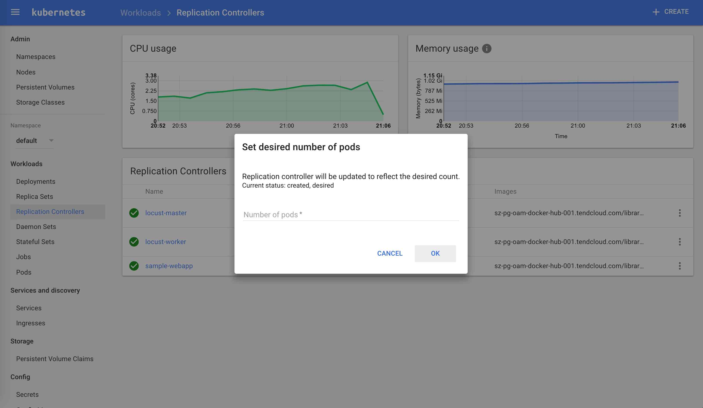
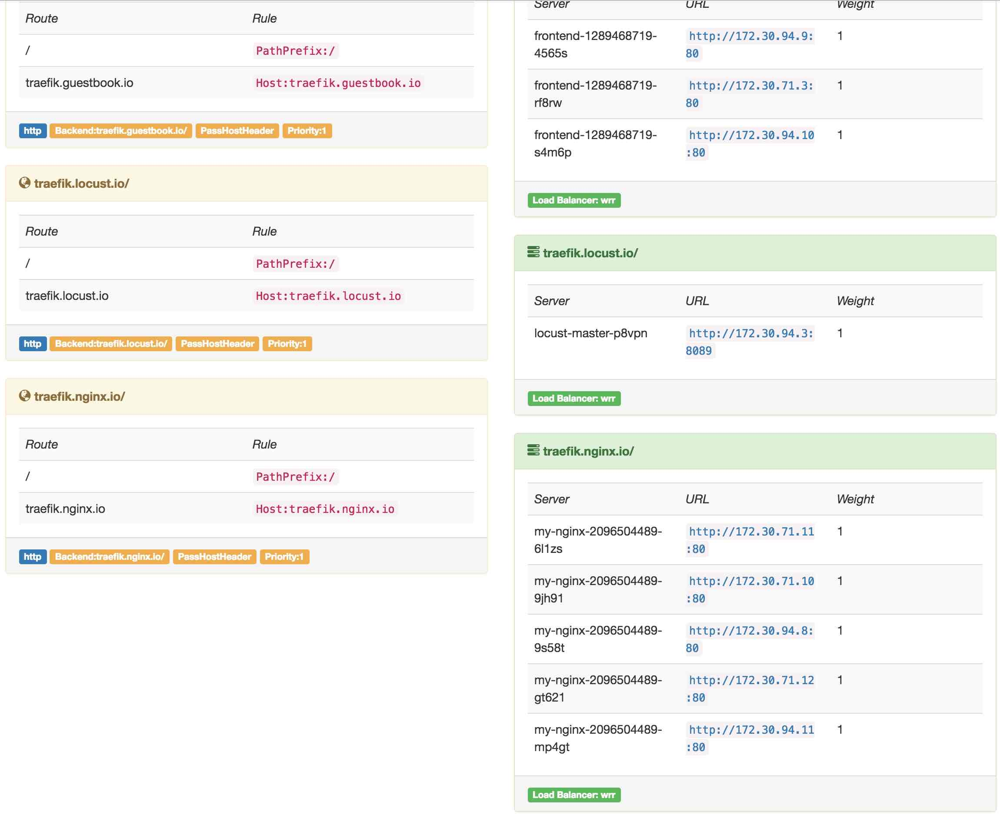
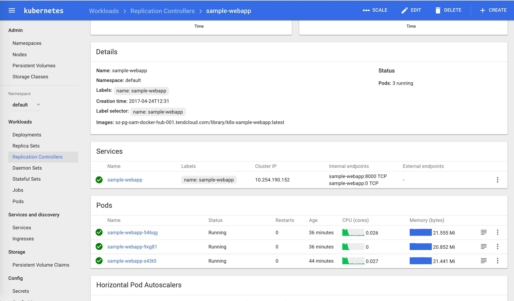
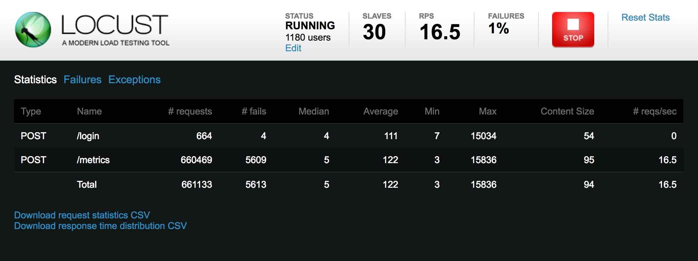

## 前言

本示例来自 [GitHub - distributed-load-testing-using-kubernetes](https://github.com/rootsongjc/distributed-load-testing-using-kubernetes)。

该教程描述如何在[Kubernetes](http://kubernetes.io)中进行分布式负载均衡测试，包括一个web应用、docker镜像和Kubernetes controllers/services。更多资料请查看[Distributed Load Testing Using Kubernetes](http://cloud.google.com/solutions/distributed-load-testing-using-kubernetes) 。

**注意：该测试是在我自己本地搭建的kubernetes集群上测试的，不需要使用Google Cloud Platform。**

## 准备

**不需要GCE及其他组件，你只需要有一个kubernetes集群即可。**

## 部署Web应用

 `sample-webapp` 目录下包含一个简单的web测试应用。我们将其构建为docker镜像，在kubernetes中运行。你可以自己构建，也可以直接用这个我构建好的镜像`index.tenxcloud.com/jimmy/k8s-sample-webapp:latest`。

在kubernetes上部署sample-webapp。

```bash
$ cd kubernetes-config
$ kubectl create -f sample-webapp-controller.yaml
$ kubectl create -f kubectl create -f sample-webapp-service.yaml
```

## 部署Locust的Controller和Service

`locust-master`和`locust-work`使用同样的docker镜像，修改cotnroller中`spec.template.spec.containers.env`字段中的value为你`sample-webapp` service的名字。

```yaml
- name: TARGET_HOST
  value: http://sample-webapp:8000
```

### 创建Controller Docker镜像（可选）

`locust-master`和`locust-work` controller使用的都是`locust-tasks` docker镜像。你可以直接下载，也可以自己编译。自己编译大概要花几分钟时间，镜像大小为820M。

```bash
$ docker build -t index.tenxcloud.com/jimmy/locust-tasks:latest .
$ docker push index.tenxcloud.com/jimmy/locust-tasks:latest
```

**注意**：我使用的是时速云的镜像仓库。

每个controller的yaml的`spec.template.spec.containers.image` 字段指定的是我的镜像：

```yaml
image: index.tenxcloud.com/jimmy/locust-tasks:latest
```

### 部署locust-master

```bash
$ kubectl create -f locust-master-controller.yaml
$ kubectl create -f locust-master-service.yaml
```

### 部署locust-worker

Now deploy `locust-worker-controller`:

```bash
$ kubectl create -f locust-worker-controller.yaml
```

你可以很轻易的给work扩容，通过命令行方式：

```bash
$ kubectl scale --replicas=20 replicationcontrollers locust-worker
```

当然你也可以通过WebUI：Dashboard - Workloads - Replication Controllers - **ServiceName** - Scale来扩容。



### 配置Traefik

参考[kubernetes的traefik ingress安装](https://jimmysong.io/posts/traefik-ingress-installation/)，在`ingress.yaml`中加入如下配置：

```Yaml
  - host: traefik.locust.io
    http:
      paths:
      - path: /
        backend:
          serviceName: locust-master
          servicePort: 8089
```

然后执行`kubectl replace -f ingress.yaml`即可更新traefik。

通过Traefik的dashboard就可以看到刚增加的`traefik.locust.io`节点。



## 执行测试

打开`http://traefik.locust.io`页面，点击`Edit`输入伪造的用户数和用户每秒发送的请求个数，点击`Start Swarming`就可以开始测试了。


在测试过程中调整`sample-webapp`的pod个数（默认设置了1个pod），观察pod的负载变化情况。



从一段时间的观察中可以看到负载被平均分配给了3个pod。

在locust的页面中可以实时观察也可以下载测试结果。



## 参考

- [Distributed Load Testing Using Kubernetes](https://cloud.google.com/solutions/distributed-load-testing-using-kubernetes)
- [运用Kubernetes进行分布式负载测试](http://www.csdn.net/article/2015-07-07/2825155)
