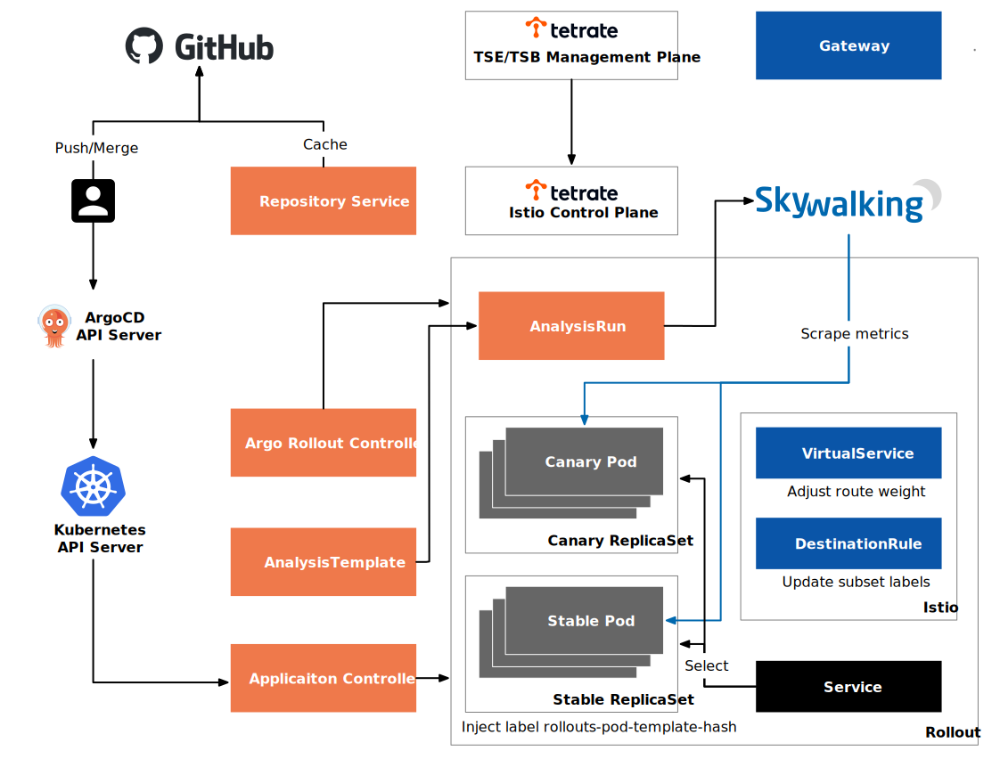
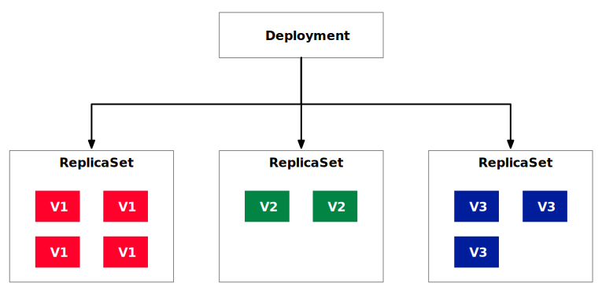
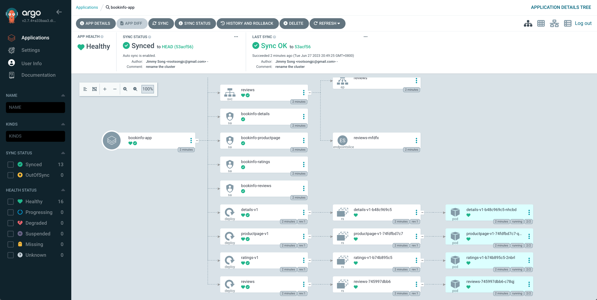
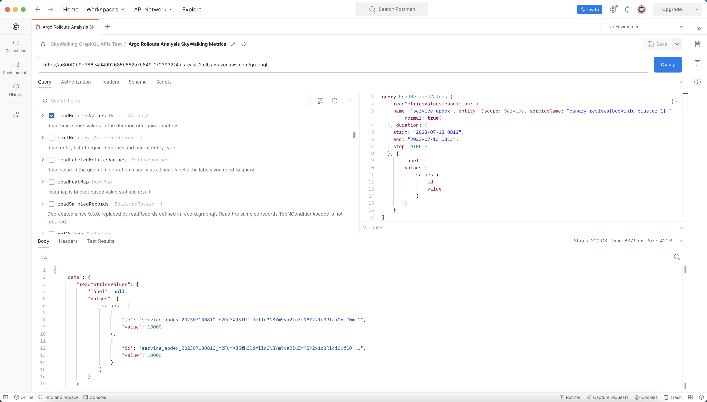

云原生应用的发展导致开发左移，应用迭代频率更高，这就催生了 GitOps 的需求。本文将介绍如何使用 Argo 项目，包括 ArgoCD 和 Argo Rollouts，通过 Istio 实现 GitOps 和金丝雀部署。文中还有一个演示，展示了如何基于 Tetrate Service Express（也适用于 Tetrate Service Bridge）提供的 Istio 环境实现 GitOps。

本文 demo 的部署架构图如图 1 所示。如果您已经熟悉本文介绍的部署策略和 Argo 项目，可以直接跳到 [demo 部分](#demo)。



## 部署策略 {#deployment-strategy}

首先，我想简单介绍一下 Argo Rollouts 支持的两种部署策略，可以实现零停机部署。

蓝绿部署和金丝雀部署的步骤如图 2 所示。


- 蓝绿部署是一种在单独的环境中并行部署新版本应用程序而不影响当前生产环境的策略。在蓝绿部署中，当前的生产环境称为“蓝色环境”，部署新版本应用程序的环境称为“绿色环境”。一旦绿色环境被认为稳定并通过测试，流量将逐渐从蓝色环境切换到绿色环境，让用户逐步接入新版本。如果切换过程中出现问题，可以快速回滚到蓝环境，最大程度地减少对用户的影响。蓝绿部署的优点是可以提供高可用性和零停机部署。
- 金丝雀部署是一种逐步将新版本或功能引入生产环境的策略。在金丝雀部署中，新版本或新功能首先部署到生产环境中的少数用户，称为“金丝雀用户”。通过监控金丝雀用户的反馈和性能指标，开发团队可以评估新版本或功能的稳定性和可靠性。如果没有问题，可以逐步将更多用户纳入金丝雀部署中，直到所有用户都使用新版本。如果发现问题，可以快速回滚或修复，避免对整个用户群造成负面影响。金丝雀部署的优点是可以快速发现问题并在影响较小的范围内进行调整。

蓝绿部署和金丝雀部署的主要区别在于部署方式和变更规模。蓝绿部署是将整个应用部署在新的环境中，然后进行切换，适合大规模的变更，比如整个应用的重大升级。金丝雀部署逐渐引入新版本或功能，适合小规模更改，例如添加或修改单个功能。

从应用场景来看，蓝绿部署适合对高可用、零宕机部署要求较高的系统。在部署大规模变更时，蓝绿部署可以保证稳定性和可靠性，并且可以快速回滚以应对突发情况。金丝雀部署适合需要快速验证新功能或版本的系统。通过逐步引入变更，可以及早发现问题并进行调整，尽量减少对用户的影响。

## Kubernetes Deployment 的发布策略 {#kuberentes-deployment}

在 Kubernetes 中，Deployment 资源对象是管理应用程序部署和更新的主要工具之一。部署提供了一种声明式方式来定义应用程序的预期状态，并通过控制器的功能实现发布策略。Deployment 的架构如图 3 所示，其中彩色方块代表不同版本的 Pod。



发布策略可以在 Deployment 的 spec 字段中配置。以下是一些常见的发布策略选项：

1. ReplicaSet 的管理：Deployment 使用 ReplicaSet 来创建和管理应用程序的副本。可以通过设置 `spec.replicas` 字段来指定所需的副本数量。在发布过程中，Kubernetes 控制器保证新版本 ReplicaSet 的副本数量在创建时逐渐增加，旧版本 ReplicaSet 的副本数量在删除时逐渐减少，实现平滑切换。
2. 滚动更新策略：部署支持多种滚动更新策略，可以通过设置 `spec.strategy.type` 字段来选择。常见政策包括：
   - `RollingUpdate`：默认策略以一定的时间间隔逐渐更新副本。不同时可用的副本数量以及额外可用的副本数量可以通过设置 `spec.strategy.rollingUpdate.maxUnavailable` 和 `spec.strategy.rollingUpdate.maxSurge` 字段来控制。
   - `ReCreate`：该策略在更新过程中首先删除旧版本的所有副本，然后创建新版本的副本。此策略将导致应用程序在更新期间暂时不可用。
3. 版本控制：Deployment 通过 `spec.template.metadata.labels` 字段为每个版本的 ReplicaSet 设置标签，以便控制器准确跟踪和管理。这样 ReplicaSet 的多个版本可以共存，并且可以精确控制每个版本的副本数量。

通过使用这些配置选项，Deployment 可以实现不同的发布策略。更新 Deployment 对象的 spec 字段可以触发新版本的发布。Kubernetes 控制器会根据指定的策略自动处理副本的创建、更新和删除，以实现平滑的应用更新和部署策略。

## 使用 ArgoCD 实施 GitOps {#argocd-gitops}

可以使用 Deployment 来手动管理发布策略，但要实现自动化，我们还需要使用 ArgoCD 等 GitOps 工具。

ArgoCD 是一个基于 GitOps 的持续交付工具，用于自动化和管理 Kubernetes 应用程序的部署。它为提高应用程序部署的效率和可靠性提供了一些关键的帮助。

以下是 ArgoCD 为 Kubernetes 应用程序部署提供的一些帮助：

1. **声明式配置**：ArgoCD 使用声明式方式定义应用程序的预期状态，并将应用程序配置存储在 Git 存储库中。通过版本控制和持续集成/持续交付 (CI/CD) 流程，可以轻松跟踪和管理应用程序配置更改。
2. **持续部署**：ArgoCD 可以监控 Git 存储库中的配置变化，并自动将应用程序部署到 Kubernetes 环境。提供可定制的同步策略，自动触发应用部署和更新，实现持续部署。
3. **状态比较和自动修复**：ArgoCD 定期检查应用程序的当前状态并将其与预期状态进行比较。如果发现不一致，它会自动尝试修复并将应用程序恢复到所需状态，以确保预期状态与实际状态的一致性。
4. **多环境管理**：ArgoCD 支持管理多个 Kubernetes 环境，例如开发、测试和生产环境。可以轻松地在不同环境之间部署和同步应用配置，确保一致性和可控性。

与 Deployment 资源对象相比，ArgoCD 提供了更高级的功能和工作流程，补充了原生 Kubernetes 资源对象的功能：

- **基于 GitOps 的配置管理**：ArgoCD 将应用程序配置存储在 Git 存储库中，从而实现基于 GitOps 的配置管理。这种方法确保配置更改是可跟踪、可审计的，并且可以与现有的 CI/CD 管道集成。

- **自动化部署和持续交付**：ArgoCD 可以自动检测 Git 存储库中的配置更改并将应用程序部署到 Kubernetes 环境，从而实现自动化部署和持续交付。

- **状态管理和自动恢复**：ArgoCD 持续监控应用程序的状态并将其与预期状态进行比较。如果检测到不一致，它会自动恢复并确保应用程序状态与预期状态保持一致。

## 使用 Istio 实现细粒度的流量路由 {#istio-routing-traffic}

虽然 ArgoCD 可以实现 GitOps，但它本质上是在 Kubernetes 部署上运行并通过副本数量控制流量路由。为了实现细粒度的流量路由，使用了 Istio 等服务网格。

Istio 通过以下方法实现更细粒度的流量路由和应用发布：

**VirtualService**：Istio 使用 VirtualService 来定义流量路由规则。通过配置 VirtualService，可以根据请求头、路径、权重等请求属性对流量进行路由和分发，将请求定向到不同的服务实例或版本。

**DestinationRule**：Istio 的 DestinationRule 用于定义服务版本策略和负载均衡设置。通过指定不同版本服务实例之间不同的流量权重，可以实现金丝雀发布、蓝绿部署等高级应用发布策略。

**流量控制和策略**：Istio 提供了丰富的流量控制和策略能力，如流量限制、故障注入、超时设置、重试机制等，这些功能帮助应用程序实现更高级别的负载均衡、容错和可靠性要求。

与 ArgoCD 和 Kubernetes Deployment 对象相比，Istio 在应用部署方面提供了以下优势：

**细粒度的流量路由控制**：Istio 提供了更丰富的流量路由能力，可以根据多种请求属性进行灵活的路由和分发，从而实现更细粒度的流量控制和管理。

**高级发布策略支持**：Istio 的 DestinationRule 可以指定不同版本服务实例之间的流量权重，支持金丝雀发布、蓝绿部署等高级应用发布策略。这使得应用程序的版本管理和发布更加灵活可控。

**强大的流量控制和策略能力**：Istio 提供了丰富的流量控制和策略能力，如流量限制、故障注入、超时设置、重试机制等，这些功能帮助应用程序实现更高级别的负载均衡、容错和可靠性要求。

将 Istio 与 Argo Rollouts 相结合，可以充分发挥 Istio 细粒度流量路由的优势。现在让我们一起进行演示。在我们的演示中，我们将使用 TSE 提供的 Kubernetes 和 Istio 环境，使用 ArgoCD 实现 GitOps，并使用 Argo Rollouts 实现金丝雀发布。

## Demo

我们的演示中使用的软件版本是：

-  Kubernetes v1.24.14
-  Istio v1.15.7
-  Argo CD v2.7.4
-  Argo 发布 v1.5.1
-  TSE Preview 2

我们将使用 Istio 的 VirtualService 和 DestinationRule 来实现基于 Subset 的流量分组路由，并使用 ArgoCD Rollouts 进行渐进式发布。

### 部署 ArgoCD 和 Argo Rollouts {#deployment-argocd-and-rollouts}

我提前创建了一个 Kubernetes 集群并将其添加到 TSE 中，TSE 会自动为集群安装 Istio 控制平面。我们还需要安装 ArgoCD 和 Argo Rollouts：

```bash
# Install ArgoCD
kubectl create namespace argocd
kubectl apply -n argocd -f https://raw.githubusercontent.com/argoproj/argo-cd/stable/manifests/install.yaml

# Install ArgoCD CLI on macOS
brew install argocd

# Change the service type of argocd-server to LoadBalancer
kubectl patch svc argocd-server -n argocd -p '{"spec": {"type": "LoadBalancer"}}'

# Get the ArgoCD UI address
ARGOCD_ADDR=$(kubectl get svc argocd-server -n argocd -o jsonpath='{.status.loadBalancer.ingress[0].hostname}')

# Login using ArgoCD CLI, see https://argo-cd.readthedocs.io/en/stable/getting_started/#4-login-using-the-cli to get password
argocd login $ARGOCD_ADDR --skip-test-tls --grpc-web --insecure

# Install Argo Rollouts
kubectl create namespace argo-rollouts
kubectl apply -n argo-rollouts -f https://github.com/argoproj/argo-rollouts/releases/download/latest/install.yaml

# Install rollouts plugin on macOS
curl -LO https://github.com/argoproj/argo-rollouts/releases/download/v1.5.0/kubectl-argo-rollouts-darwin-amd64
chmod +x ./kubectl-argo-rollouts-darwin-amd64
sudo mv ./kubectl-argo-rollouts-darwin-amd64 /usr/local/bin/kubectl-argo-rollouts
```

该功能不适用于 TSE Bridge Mode，因此我们将使用 TSE Direct Mode 来实现渐进式发布。




直接模式和桥接模式是 TSE 中控制平面下发配置的两种模式。适用于流量、安全、网关组配置模式。BRIDGED 模式是一种极简模式，允许用户使用 Tetrate 特定的 API 快速配置服务网格中最常用的功能，而 DIRECT 模式为高级用户提供更大的灵活性，允许他们直接使用 Istio API 进行配置。



接下来，部署 Rollouts Dashboard：

```bash
git clone https://github.com/argoproj/argo-rollouts.git
kustomize build manifests/dashboard-install|kubectl apply -n argo-rollouts -f -
kubectl port-forward svc/argo-rollouts-dashboard -n argo-rollouts 3100:3100
```

您现在可以通过 <https://localhost:3100/rollouts/> 访问 Rollouts 仪表板。

### 部署 Bookinfo 应用 {#bookinfo}

我们已经为 Bookinfo 应用程序准备了配置文件（保存在 [tse-gitops-demo](https://github.com/tetrateio/tse-gitops-demo/) 存储库中），您也可以将其 fork 到您自己的帐户并将其替换为您自己的存储库。运行以下命令来部署 Bookinfo 应用程序：

```bash
argocd app create bookinfo-app --repo https://github.com/tetrateio/tse-gitops-demo.git --path application --dest-server https://kubernetes.default.svc --dest-namespace bookinfo --sync-policy automated
```

注意：我们在 [`reviews` 部署](https://github.com/tetrateio/tse-gitops-demo/blob/main/application/bookinfo.yaml#L151)中将 `replicas` 设置为 `0` ，因为我们将创建 Argo Rollouts 来操纵 `reviews` 的实例数量服务。如果这里设置为非零正整数，我们将无法实现金丝雀部署。

现在您可以在浏览器中打开 ArgoCD UI，如图 4 所示。



如果您发现应用程序状态不同步，可以运行以下命令或单击 UI 中的 SYNC 按钮。

```bash
argocd app sync bookinfo-app
```

## 使用 Istio 实施细粒度流量管理 {#istio-fine-grain-traffic-management}

首先，我们使用 Argo CD 创建 Istio 相关的资源对象：

```bash
argocd app create bookinfo-tse-conf --repo https://github.com/tetrateio/tse-gitops-demo.git --path argo/tse --dest-server https://kubernetes.default.svc --dest-namespace bookinfo --sync-policy automated --self-heal

# Check the creation status
argocd app get bookinfo-tse-conf
```

### 将 Deployment 转换为 Rollout {#convert-deployment-to-rollout}

假设我们要发布新版本的 `reviews` 服务。为了实现零停机更新，我们将使用金丝雀部署，具体步骤如下：

1. 将 `reviews` Deployment 的 `replicas` 减少为 0；
2. 创建引用先前在 Bookinfo 应用程序中部署的 `reviews` Deployment 的 Rollout；
3. 将流量发送到 `reviews` 服务以实现自动金丝雀部署进度。

您可以在 GitHub 上查看本演示中使用的 Rollout 和 AnalysisTemplate 配置。运行以下命令来部署 `reivews-rollout` ：

```bash
argocd app create reviews-rollout --repo https://github.com/tetrateio/tse-gitops-demo.git --path argo/rollout --dest-server https://kubernetes.default.svc --dest-namespace bookinfo --sync-policy automated
```

注意：我们可以使用 `argocd` 命令来部署或使用 `kubectl apply` 。推荐使用 `argocd` ，因为您可以同时在 ArgoCD UI 和 Argo Rollouts Dashboard 中查看部署状态，并使用 `argocd` 命令管理部署。

在 Argo Rollouts Dashboard 中查看 `reviews` 部署的状态，并使用以下命令将流量发送到 `reviews` 服务一段时间：

```bash
export GATEWAY_HOSTNAME=$(kubectl -n bookinfo get service tsb-gateway-bookinfo -o jsonpath='{.status.loadBalancer.ingress[0].hostname}')
while 1;do curl -H "Host: bookinfo.tetrate.com" http://$GATEWAY_HOSTNAME/api/v1/products/1/reviews;sleep 3;done
```

您将在输出中看到来自具有不同 rollouts-pod-template-hash 标签的 pod 的响应，这证明金丝雀部署是有效的。大约 10 分钟后，您看到的 Argo Rollouts 仪表板将如图 5 所示。


从图 5 中我们可以看到金丝雀部署进展顺利，已经到了第三步。这是因为 `reviews` 服务的 `apdex` （应用性能指数）指标正常。您可以[使用 Postman 向 SkyWalking 提交 GraphQL 查询](https://tetrate.io/blog/how-to-use-graphql-to-query-observability-data-from-skywalking-with-postman/)来验证这一点，如图 6 所示。



我们构建的 GraphQL 查询语句如下：

```graphql
query ReadMetricsValues {
    readMetricsValues(condition: {
    name: "service_apdex", entity: {scope: Service, serviceName: "canary|reviews|bookinfo|cluster-1|-", normal: true}
  }, duration: {
    start: "2023-07-13 0812",
    end: "2023-07-13 0813",
    step: MINUTE
  }) {
        label
        values {
            values {
                id
                value
            }
        }
    }
}
```

该语句从 UTC `2023-07-13 8:12` 到 `2023 8:13` 查询 `canary|reviews|bookinfo|cluster-1|-` 服务的 `apdex` 指标，持续两分钟，得到以下结果：

```json
{
    "data": {
        "readMetricsValues": {
            "label": null,
            "values": {
                "values": [
                    {
                        "id": "service_apdex_202307130812_Y2FuYXJ5fHJldmlld3N8Ym9va2luZm98Y2x1c3Rlci0xfC0=.1",
                        "value": 10000
                    },
                    {
                        "id": "service_apdex_202307130813_Y2FuYXJ5fHJldmlld3N8Ym9va2luZm98Y2x1c3Rlci0xfC0=.1",
                        "value": 10000
                    }
                ]
            }
        }
    }
}
```

`apdex` 指标的值大于 9900（AnalysisTemplate 的 `successCondition` 中配置的阈值），因此 Rollouts 会顺利进行。您还可以在 Argo Rollouts Dashboard 上单击“手动升级”来升级它，或运行以下命令：

```bash
kubectl argo rollouts promote reviews-rollout -n bookinf
```

## 清理 {#clean-up}

删除已部署的 ArgoCD 应用程序和 Rollout：

```bash
argocd app delete -y reviews-rollout
argocd app delete -y bookinfo-tse-conf
argocd app delete -y bookinfo-app
```

## Argo Rollouts 原理 {#rollouts-principle}

与 Istio 集成时，Argo Rollouts 支持基于 VirtualService 和 Subset 的流量拆分，如图 7 所示。


下表提供了这两种流量分段方法的详细比较。

| 类型           | 适用场景                             | 资源对象                                          | 原则                                                         |
| :------------- | :----------------------------------- | :------------------------------------------------ | :----------------------------------------------------------- |
| 主机级流量分割 | 适用于根据主机名访问不同版本的服务； | 2 个服务、1 个虚拟服务、1 个部署；                | Rollout 将 rollouts-pod-template-hash 标签注入到 ReplicaSet 中，并通过更新 Service 中的选择器来选择带有这些标签的 pod； |
| 子集级流量分割 | 适用于根据标签访问不同的服务；       | 1 个服务、1 个虚拟服务、1 个目标规则和 1 个转出； | Rollout 将 rollouts-pod-template-hash 标签注入到 ReplicaSet 中，并通过更新 DestinationRule 中的选择器来选择具有这些标签的 pod； |

本演示中使用基于子集的流量分割，Argo 不断推出：

- 修改 VirtualService `spec.http[].route[].weight` 以匹配当前所需的金丝雀权重
- 修改 DestinationRule `spec.subsets[].labels` 以包含 canary 和稳定 ReplicaSet 的 `rollouts-pod-template-hash` 标签

请访问 [Argo Rollouts 文档](https://argo-rollouts.readthedocs.io/en/stable/features/traffic-management/istio/)，了解有关使用 Istio 进行流量管理的详细信息。

## 总结 {#summary}

本文介绍如何使用 Argo 项目和 Istio 实现 GitOps 和金丝雀部署。首先我们使用 ArgoCD 实现 GitOps，然后使用 Argo Rollout 和 SkyWalking 实现自动化金丝雀发布。从 demo 中我们可以看到 TSE 部署的 Istio 与开源版本完全兼容。TSE 有许多功能值得探索，请访问 [Tetrate 网站](https://tetrate.io/tetrate-service-express/)了解更多信息。
