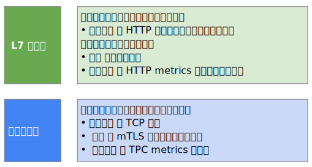

今天 [Istio 社区推出了 Ambient Mesh](https://lib.jimmysong.io/blog/introducing-ambient-mesh/)，这是一种新的 Istio 数据平面模式，旨在简化操作、扩大应用兼容性并降低基础设施成本。用户可以选择将 Ambient Mesh 集成到其基础设施的网格数据平面，放弃 sidecar 代理，同时保持 Istio 的零信任安全、遥测和流量管理等核心功能。该模式目前还是预览版，Istio 社区准备在未来几个月内将其推向生产就绪。

Ambient Mesh 推出的消息对于社区来说可能显得有些突然，但其实关于 sidecar 模式对于资源的消耗过大，以及简化服务网格的呼声在社区里已经存在很久了，Google 从多年前就在寻求 HBONE（HTTP-Based Overlay Network Environment，基于 HTTP 的重叠网络环境）解决方案，还有社区提出的[多种 sidecar 部署模式](/blog/beyond-istio-oss/#sidecar-management)、[proxyless 模式](/blog/beyond-istio-oss/#proxyless-pattern) 等都是为了解决这个问题。

## 什么是 Ambient 模式？{#what-is-ambient-mode}

Ambient 模式是 Istio 社区在 2022 年 9 月推出的一种无 sidecar 的 Istio 数据平面部署模式，下图展示了 Ambient 模式的架构。


从图中我们可以看到 Ambient 模式对应用程序本身没有任何侵入，而是在应用程序外围：

1. 同 node 上部署 ztunnel：使用 Envoy 实现的共享代理，多租户模式，负责 L4 网络，主要是安全性方面；
2. 以服务账户为单位部署 Waypoint proxy：同样使用 Envoy 实现，单租户模式，使用 Gateway API 部署的 Gateway 资源，负责 L7 网络，当服务需要 L7 网络功能的时候才部署；

下面是 Ambient 模式的功能分层。



关于 Ambient 模式的更多介绍请阅读：

- [Istio 无 sidecar 代理数据平面 ambient 模式简介](https://lib.jimmysong.io/blog/introducing-ambient-mesh/)
- [Istio 服务网格 ambient 模式安全详解](https://lib.jimmysong.io/blog/ambient-security/)
- [什么是 Ambient Mesh，它与 sidecar 模式有什么区别？](https://lib.jimmysong.io/blog/what-is-ambient-mesh/)

## Ambient 模式的核心技术 {#ambient-core}

Ambient 模式中的 ztunnel 和 Waypoint proxy 目前还是使用 Envoy 来实现的，未来不排除使用其他语言（非 C++，如 Rust）来实现一个轻量级的 ztunnel。该模式的核心是所谓的 HBONE（HTTP Based Overlay Network Environment，基于 HTTP 的覆盖网络环境）。

HBONE 基于 HTTP/2 CONNECT，将工作负载之间的请求以流的形式进行隧道传输，尽可能地复用 HTTP/2 连接。HBONE 对工作负载来说是透明的，支持更好的传输机制：

- 支持多协议，包括 [Server First 协议](https://istio.io/latest/docs/ops/deployment/requirements/#server-first-protocols)，如 MySQL。Istio 可以自动检测出 HTTP 和 HTTP/2 流量。如果未自动检测出协议，流量将会视为普通 TCP 流量。对于 Server First 协议必须明确声明，否则将作为 TCP 流量处理；
- 对于使用自己 TLS 证书的应用程序可以逐步采用 Istio；
- 支持绕过 Istio mTLS 封装直接调用 Pod IP；

## Sidecar 模式的限制 {#sidecar-limitations}

其实 ambient 模式的出现，主要是因为 sidecar 模式有以下限制：

- Sidecar 容器不是 pod 中的一等公民，它的生命周期不受控制，有可能在 sidecar 就没准备好的情况下，pod 就开始接收连接，让 sidecar 的生命周期与应用程序 pod 绑定，这本身就是对应用程序的一种侵入
- Sidecar 无法解释不规范的七层系列，如 HTTP 和 gRPC；
- 如果仅需服务网格的安全功能，那么引入 sidecar 是一次过大的投资，因为它增加了很多七层网络功能，这些是用不到的，客户无法做到渐进式采用服务网格；
- Sidecar 升级时，应用程序需要重新部署或者启动，这需要对应用程序进行协调；

## 关于 Ambient 模式的看法 {#ambient-insight}

本文我将谈谈对 ambient 模式的几点看法：

1. **关于 Ambient Mesh 的命名**：我觉得叫做 **Ambient Mode** 会更好，有些接触 Istio 的初学者可能会觉得它是一种全新的不同于 Istio 的 service mesh；另外关于这个模式的中文翻译，如果直接翻译成“环境网格”似乎让人很难理解，我还想到了其他词汇，如“外围”、“氛围”、“周围”、“环绕”、”情景”等，没有一个汉语词汇可以准确表达这个 ambient 的含义，因为相对于 sidecar 模式，ambient 模式对应用程序 pod 没有侵入性，暂且将其称之为**外围模式**。
2. **Ambient Mode 的本质**：它的本质是分离 sidecar proxy（Envoy）中的 L4 和 L7 功能，让一部分仅需要安全功能的用户可以最小阻力（低资源消耗、运维成本）地使用 Istio service mesh。
3. **Ambient Mode 的意义**：因为它 sidecar 模式兼容，用户在采纳 Ambient Mode 获得了 mTLS 和有限的可观察性及 TPC 路由等 L4 功能，之后可以更方便的过度到 sidecar mode 以获得完全的 L7 功能。这给用户采纳 Istio 提供了更多模式选择，优化了 Istio 采纳路径。
4. **Ambient Mode 的坏处**：Proxyless、sidecar、ambient 模式，使得 Istio 越来越复杂，用户理解起来更加费力；控制平面为了支持多种数据平面部署模式，其实现将更加复杂。
5. **与其他服务网格的关系**：有的 service mesh 从原先的 per-proxy per-node 模式转变为 sidecar mode，如 Linkerd；还有的从 CNI 做到 service mesh，如 Cilium 使用 per-proxy per-node 模式；如今 Istio 在 sidecar mode 的基础上增加了 ambient mode，这也是目前唯一同时支持这两种部署模式的服务网格，为用户提供了多样的选择。
6. **安全问题**：虽然 [Istio 服务网格 ambient 模式安全详解](https://lib.jimmysong.io/blog/ambient-security/) 说明了ambient 模式的设计主旨是为了将应用程序与数据平面分离，让安全覆盖层的组件（ztunnel）处于类似于 CNI 的网格底层，考虑到 ztunnel 有限的 L4 攻击面，该模式的安全风险是可以接受的；但是，ztunnel 作为 DaemonSet 部署在每个节点上，需要处理和分发调度到该节点上的所有 pod 的证书来建立 mTLS 连接，一旦 一个 ztunnel 被攻破，它的爆炸半径确实是大于一个 sidecar，安全详解的博客中说 Envoy 的 CVE 问题会影响所有 sidecar，升级 sidecar 也会带来很大的运营成本，所以权衡之下选择 ambient 模式，安全问题再次给用户造成了困惑，不过最终选择的权利还是在用户自己。

## 安装试用 {#setup}

参考 [Istio 官网中的步骤](https://istio.io/latest/blog/2022/get-started-ambient/)安装：

1. [下载 Ambient Mesh 预览版](https://gcsweb.istio.io/gcs/istio-build/dev/0.0.0-ambient.191fe680b52c1754ee72a06b3e0d3f9d116f2e82)；

2. 检查 Kubernetes 版本，建议的大于等于 1.21；

3. 安装 Ambient profile：

   ```bash
   istioctl install --set profile=ambient
   ```

4. 部署示例应用：

   ```bash
   kubectl apply -f samples/bookinfo/platform/kube/bookinfo.yaml
   kubectl apply -f https://raw.githubusercontent.com/linsun/sample-apps/main/sleep/sleep.yaml
   kubectl apply -f https://raw.githubusercontent.com/linsun/sample-apps/main/sleep/notsleep.yaml
   kubectl apply -f samples/bookinfo/networking/bookinfo-gateway.yaml
   ```

5. 将应用添加到 Ambient Mesh：

   ```bash
   kubectl label namespace default istio.io/dataplane-mode=ambient
   ```

6. 发送测试流量：

   ```bash
   kubectl exec deploy/sleep -- curl -s http://istio-ingressgateway.istio-system/productpage | head -n1
   kubectl exec deploy/sleep -- curl -s http://productpage:9080/ | head -n1
   kubectl exec deploy/notsleep -- curl -s http://productpage:9080/ | head -n1
   ```

7. 在将 Pod 加入到 Ambient Mesh 中之后，就可以给这些 Pod 应用 L4 的授权策略：

   ```bash
   kubectl apply -f - <<EOF
   apiVersion: security.istio.io/v1beta1
   kind: AuthorizationPolicy
   metadata:
    name: productpage-viewer
    namespace: default
   spec:
    selector:
      matchLabels:
        app: productpage
    action: ALLOW
    rules:
    - from:
      - source:
          principals: ["cluster.local/ns/default/sa/sleep", "cluster.local/ns/istio-system/sa/istio-ingressgateway-service-account"]
   EOF
   ```

   上面这个策略只允许 sleep 服务和 istio ingress gateway 访问 productpage。

8. 应用 L7 策略：

   ```bash
   kubectl apply -f - <<EOF
   apiVersion: gateway.networking.k8s.io/v1alpha2
   kind: Gateway
   metadata:
    name: productpage
    annotations:
      istio.io/service-account: bookinfo-productpage
   spec:
    gatewayClassName: istio-mesh
   EOF
   ```

   使用 Gateway API 创建了一个 Gateway，这里实际是在 `default` 命名空间下创建了一个 waypoint proxy，专门用于处理 L7 流量。

   在给它应用授权策略：

   ```yaml
   kubectl apply -f - <<EOF
   apiVersion: security.istio.io/v1beta1
   kind: AuthorizationPolicy
   metadata:
    name: productpage-viewer
    namespace: default
   spec:
    selector:
      matchLabels:
        app: productpage
    action: ALLOW
    rules:
    - from:
      - source:
          principals: ["cluster.local/ns/default/sa/sleep", "cluster.local/ns/istio-system/sa/istio-ingressgateway-service-account"]
      to:
      - operation:
          methods: ["GET"]
   EOF
   ```

   这个策略跟之前有所不同的是最后的 `to` 字段定义了 HTTP 方法，现在你在 sleep pod 中对 productpage 服务执行除 GET 以外的其他请求都将失败。从 notsleep pod 中对 productpage 服务的 GET 请求将成功。

   现在你可以从前面创建的这个 productpage Gateway 中获取到 HTTP 请求的 Prometheus 指标信息。

   ```bash
   kubectl exec deploy/bookinfo-productpage-waypoint-proxy -- curl -s http://localhost:15020/stats/prometheus | grep istio_requests_total
   ```

9. **给 Reviews 服务创建 Gateway（Waypoint proxy），所有访问 Reviews 服务的 L7 流量都会经过它。**

   ```yaml
   kubectl apply -f - <<EOF
   apiVersion: gateway.networking.k8s.io/v1alpha2
   kind: Gateway
   metadata:
    name: reviews
    annotations:
      istio.io/service-account: bookinfo-reviews
   spec:
    gatewayClassName: istio-mesh
   EOF
   ```

   再给它应用流量划分：

   ```bash
   kubectl apply -f samples/bookinfo/networking/virtual-service-reviews-90-10.yaml
   kubectl apply -f samples/bookinfo/networking/destination-rule-reviews.yaml
   ```

   发送 100 次请求测试流量切分结果。

   ```bash
   kubectl exec -it deploy/sleep -- sh -c 'for i in $(seq 1 100); do curl -s http://istio-ingressgateway.istio-system/productpage | grep reviews-v.-; done'
   ```

   你将获得请求结果，说明一切运行正常。

## 如何开启 Ambient Mesh？{#enable-ambient}

在安装有 Istio 的 Kubernetes 中部署了你的应用之后，如果想要给命名空间 `ns-a` 启用 Ambient Mode，只需要运行：

```bash
kubectl label namespace ns-a istio.io/dataplane-mode=ambient
```

Ambient Mesh 默认启用 L4 安全。

## 如何启用 L7 网络功能？{#enable-l7}

Ambient 模式的 L7 网络功能是按需启用的：假如你想给服务 A 访问服务 B 的路径开启 L7 网络功能，那么你需要给服务 B 创建 Gateway。

另外，L7 网络功能是与服务账户绑定的，假如服务 `svc-a` 的服务账户是 `sa-svc-a`，那么给它部署一个 Gateway：

```yaml
apiVersion: gateway.networking.k8s.io/v1alpha2
kind: Gateway
metadata:
 name: svc-a
 annotations:
   istio.io/service-account: sa-svc-a
spec:
 gatewayClassName: istio-mesh
```

然后你就可以创建 `VirtualService`、`DestinationRule` 等资源管理服务 `svc-a`。

该 Gateway 实际上是一个 Deployment，它可以部署在与应用程序不同的命名空间中，你可以对这个 Deployment 单独管理和扩缩容。

## Ambient 模式的限制 {#limitation}

目前 ambient 模式的代码位于 Istio 代码库的 [`experimental-ambient` 分支](https://github.com/istio/istio/tree/experimental-ambient)，[根据 Matt Klein 和 Louis Ryan 的说法](https://twitter.com/mattklein123/status/1567870635568955392?ref_src=twsrc%5Etfw)，ztunnel 和 Waypoint proxy 是用 Envoy 实现的，其中 ztunnel 是精简后的 Envoy，只负责 L4 功能且继续使用 xDS 协议来控制。但是 ambient 模式依然有很多[限制](https://github.com/istio/istio/tree/experimental-ambient#limitations)，例如：

- 对 Kubernetes 版本的要求不低于 1.21
- 不支持 `EnvoyFilter`；
- 不支持 IPv6；
- 直接对 Pod IP 而不是 service 的请求在某些情况下将无效；
- Ambient 模式下的服务无法通过 `LoadBalancer` 和 `NodePort` 方式访问，不过你可以部署一个入口网关（未启用 ambient 模式）以从外部访问服务；
- 不支持 Calico CNI 和 Dataplane V2 CNI，因为 Ambient 模式会使用 Istio CNI，与其他 CNI 冲突；

[这里](https://github.com/istio/istio/tree/experimental-ambient#supported-environments)有安装 ambient 模式的详细环境要求。

## 更多 {#more}

以上就是笔者对 ambient 模式（外围模式）的看法，该模式还处于试验阶段，但绝不是玩具，据信已在某些场景试验过。笔者也将继续追踪该模式的最新进展，请保持关注。也欢迎更多关注 Istio 的朋友[加入云原生社区 Istio 讨论群](https://cloudnative.to/community/join/)，与社区大咖一起探讨，或者在本文下面评论聊聊你的看法。
