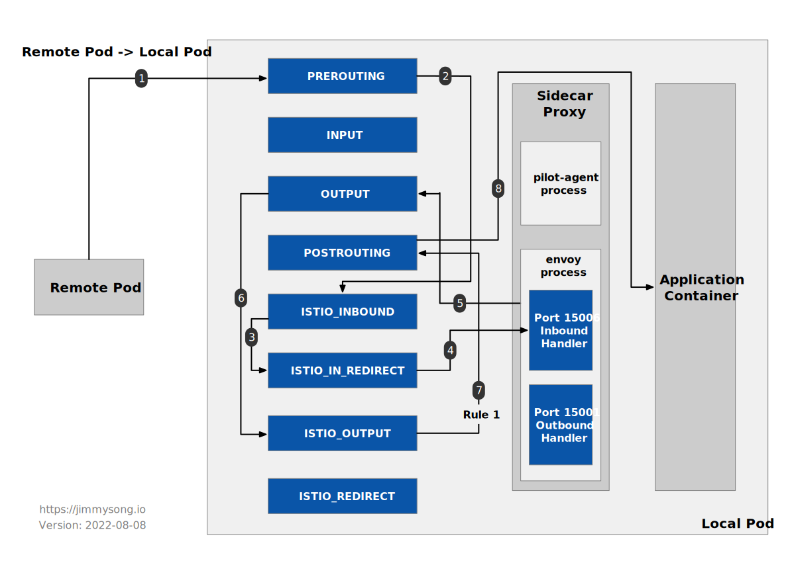
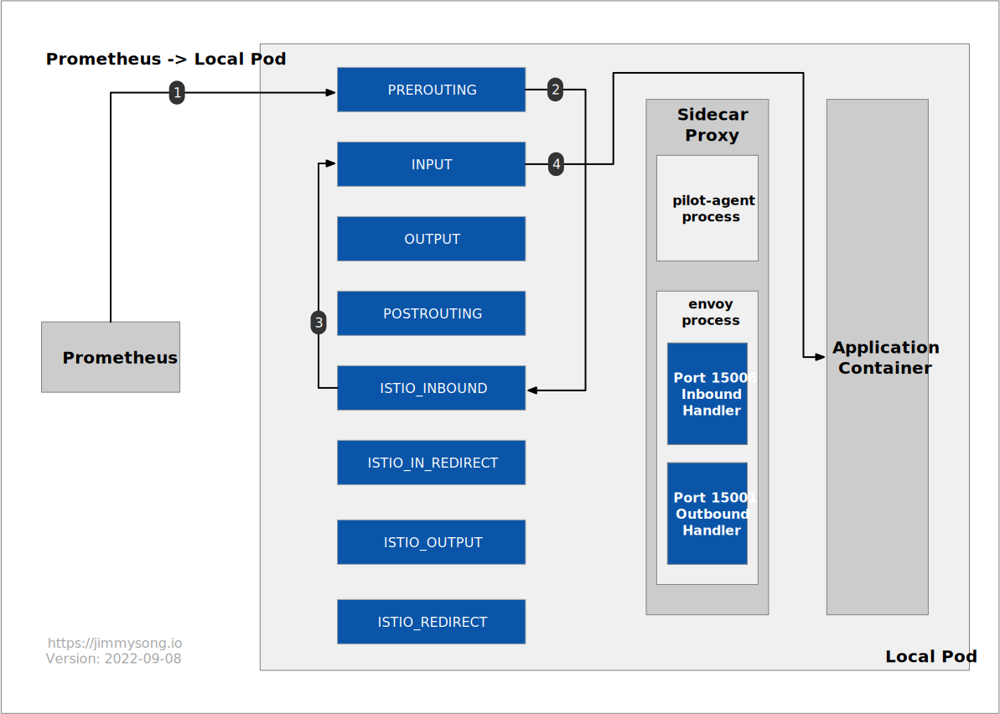
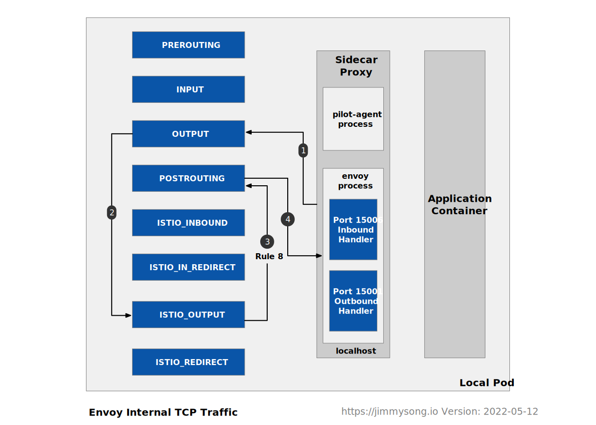
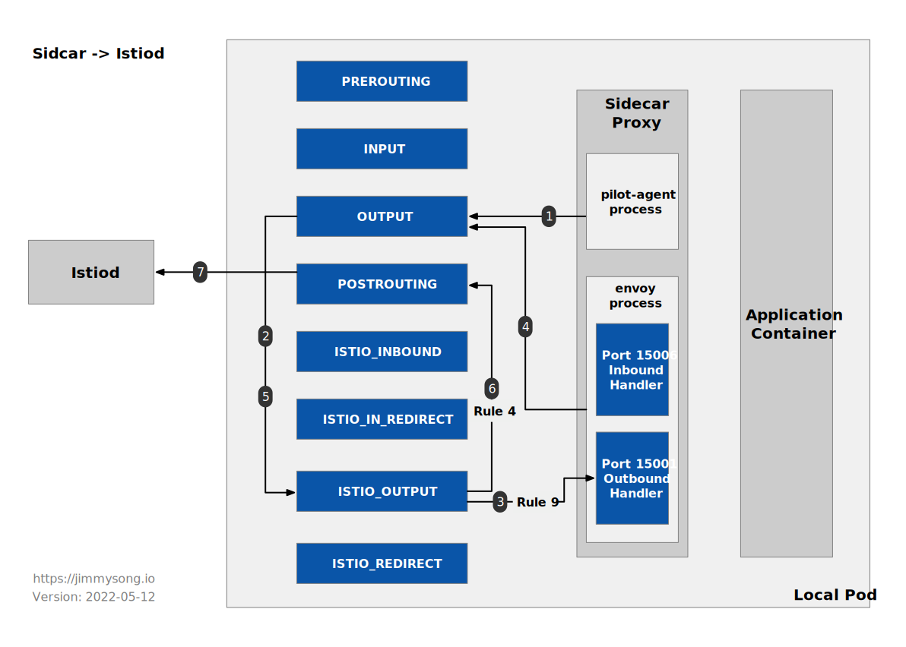

我在[之前的一篇博客中](https://jimmysong.io/blog/sidecar-injection-iptables-and-traffic-routing/)讲解过 Istio 中 sidecar 的注入、使用 iptables 进行透明流量拦截及流量路由的详细过程，并以 Bookinfo 示例中的 `productpage` 服务访问 `reviews` 服务，和 `reviews` 服务访问 `ratings` 服务为例绘制了透明流量劫持示意图。在那个示意图中仅展示了 `reviews` pod 接收流量和对外访问的路由，实际上 sidecar 内的流量远不止于此。

## ISTIO_OUTPUT 规则

在所有的 iptables 调用链中最复杂的一个是 `ISTIO_OUTPUT`，其中共有 9 条规则如下：

| **Rule** | **target**        | **in** | **out** | **source** | **destination**                 |
| -------- | ----------------- | ------ | ------- | ---------- | ------------------------------- |
| 1        | RETURN            | any    | lo      | 127.0.0.6  | anywhere                        |
| 2        | ISTIO_IN_REDIRECT | any    | lo      | anywhere   | !localhost owner UID match 1337 |
| 3        | RETURN            | any    | lo      | anywhere   | anywhere !owner UID match 1337  |
| 4        | RETURN            | any    | any     | anywhere   | anywhere owner UID match 1337   |
| 5        | ISTIO_IN_REDIRECT | any    | lo      | anywhere   | !localhost owner GID match 1337 |
| 6        | RETURN            | any    | lo      | anywhere   | anywhere !owner GID match 1337  |
| 7        | RETURN            | any    | any     | anywhere   | anywhere owner GID match 1337   |
| 8        | RETURN            | any    | any     | anywhere   | localhost                       |
| 9        | ISTIO_REDIRECT    | any    | any     | anywhere   | anywhere                        |

本文将向你展示 Istio sidecar 中的六种流量类型及其 iptables 规则， 以示意图的形式带你一览其全貌，其中详细指出了路由具体使用的是 `ISTIO_OUTPUT` 中的哪一条规则。

## Sidecar 中的 iptables 流量路由

Sidecar 中的流量可以划分为以下几类：

- 远程服务访问本地服务：Remote Pod -> Local Pod
- 本地服务访问远程服务：Local Pod -> Remote Pod
- Prometheus 抓取本地服务的 metrics：Prometheus -> Local Pod
- 本地 Pod 服务间的流量：Local Pod -> Local Pod
- Envoy 内部的进程间 TCP 流量
- Sidecar 到 Istiod 的流量

下面将依次解释每个场景下 Sidecar 内的 iptables 路由规则。

## 类型一：Remote Pod -> Local Pod

以下是远程服务、应用或客户端访问数据平面本地 Pod IP 的 iptables 规则。

Remote Pod -> `RREROUTING` -> `ISTIO_INBOUND` -> `ISTIO_IN_REDIRECT` -> Envoy 15006（Inbound）-> `OUTPUT` -> **`ISTIO_OUTPUT` RULE 1** -> `POSTROUTING` -> Local Pod

我们看到流量只经过一次 Envoy 15006 Inbound 端口。这种场景下的 iptables 规则的示意图如下。

## 类型二：Local Pod -> Remote Pod

以下是本地 Pod IP 访问远程服务经过的 iptables 规则。

Local Pod-> `OUTPUT` -> **`ISTIO_OUTPUT` RULE 9** -> ISTIO_REDIRECT -> Envoy 15001（Outbound）-> `OUTPUT` -> **`ISTIO_OUTPUT` RULE 4** -> `POSTROUTING` -> Remote Pod

我们看到流量只经过 Envoy 15001 Outbound 端口。

以上两种场景中的流量都只经过一次 Envoy，因为该 Pod 中只有发出或接受请求一种场景发生。

## 类型三：Prometheus -> Local Pod

Prometheus 抓取数据平面 metrics 的流量不会也无须经过 Envoy 代理。

这些流量通过的 iptables 规则如下。

Prometheus-> `RREROUTING` -> `ISTIO_INBOUND`（对目的地为 15002、15090 端口流量将转到 `INPUT`）-> `INPUT` -> `OUTPUT` -> **`ISTIO_OUTPUT` RULE 3** -> `POSTROUTING`  -> Local Pod

这种场景下的 iptables 规则的示意图如下。

## 类型四：Local Pod -> Local Pod

一个 Pod 可能同时存在两个或多个服务，如果 Local Pod 访问的服务也在该当前 Pod 上，流量会依次经过 Envoy 15001 和 Envoy 15006 端口最后到达本地 Pod 的服务端口上。

这些流量通过的 iptables 规则如下。

Local Pod-> `OUTPUT` -> **`ISTIO_OUTPUT` RULE 9** -> `ISTIO_REDIRECT` -> Envoy 15001（Outbound）-> `OUTPUT` -> **`ISTIO_OUTPUT` RULE 2** -> `ISTIO_IN_REDIRECT` -> Envoy 15006（Inbound）-> `OUTPUT` -> **`ISTIO_OUTPUT` RULE 1** -> `POSTROUTING` -> Local Pod

## 类型五：Envoy 内部的进程间 TCP 流量

Envoy 内部进程的 UID 和 GID 为 1337，它们之间的流量将使用 lo 网卡，使用 localhost 域名来通信。

这些流量通过的 iptables 规则如下。

Envoy 进程（Localhost） -> `OUTPUT` -> **`ISTIO_OUTPUT` RULE 8** -> `POSTROUTING` -> Envoy 进程（Localhost）

## 类型六：Sidecar 到 Istiod 的流量

Sidecar 需要访问 Istiod 以同步配置，`pilot-agent` 进程会向 Istiod 发送请求，以同步配置。

这些流量通过的 iptables 规则如下。

`pilot-agent` 进程 -> `OUTPUT` -> **`Istio_OUTPUT` RULE 9** -> Envoy 15001 (Outbound Handler) -> OUTPUT -> **`ISTIO_OUTPUT` RULE 4** -> `POSTROUTING`  -> Istiod

## 总结

Istio 注入在 Pod 内或虚拟机中安装的所有 sidecar 代理组成了服务网格的数据平面，也是 Istio 的主要工作负载所在地，通过 [Istio 中的透明流量劫持](https://jimmysong.io/blog/sidecar-injection-iptables-and-traffic-routing/) 及这篇博客，相信你一定对 sidecar 代理中的流量有了一个深刻的了解，但这还只是管中窥豹，略见一斑，在我的[下一篇博客](https://jimmysong.io/blog/istio-components-and-ports/)中，我将带你了解 Envoy 中各个组件的端口及其功能，这样可以让我们对 Istio 中的流量有一个更全面的了解。
