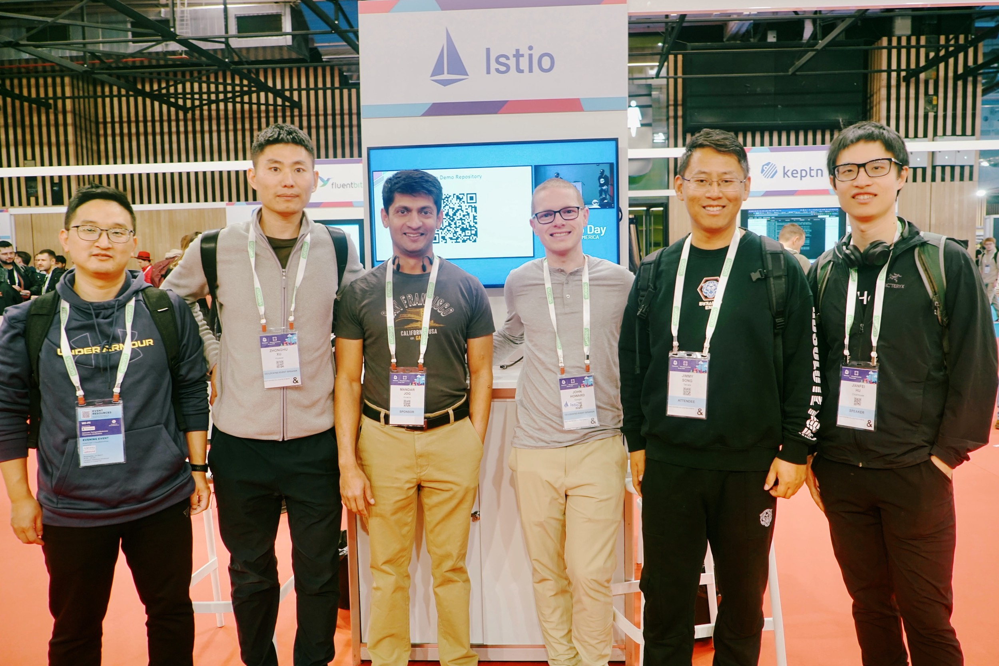

上周我在巴黎参加了 [KubeCon EU 2024](https://events.linuxfoundation.org/kubecon-cloudnativecon-europe/)，这也是我第一次参加中国以外的 KubeCon。本次大会可谓盛况空前，据说有 1.2 万人参加了会议。本文将为你分享我对本次 KubeCon 的一些观察，主要着重在我关注的服务网格与云原生基础架构领域。

## Istio、Cilium 及服务网格

[Istio](https://istio.io) 和 Service Mesh 成为了热门讨论的话题，集中展示了在云原生生态系统中这两项技术的最新进展和应用。本次大会涵盖了从基础设施优化、数据本地化、分布式追踪到多集群部署等多个领域，反映了 Service Mesh 技术在实际应用中的广泛关注和持续创新。

### 数据本地化和全局请求路由

Pigment 的 Arthur Busser 和 Baudouin Herlicq 分享了如何利用 Kubernetes 和 Istio 实现数据本地化的需求。他们介绍了利用 Istio 基于自定义头部进行请求路由的方法，这对于满足如 GDPR 和 CCPA 等法规的数据驻留要求至关重要。

### 分布式跟踪和可观测性增强

ThousandEyes (part of Cisco) 的 Chris Detsicas 探讨了如何配置 Istio 以使用 OpenTelemetry 实现有效的分布式跟踪，这为微服务生态系统提供了宝贵的可见性，有助于问题诊断和性能优化。

### 多集群部署和流量管理

China Mobile 的 Haiwen Zhang 和 Yongxi Zhang 介绍了一个简化 Istio 多集群部署的新方法，该方法使用一个全局唯一的 Istio 控制平面，通过主集群的 Apiserver 实现全局服务发现，自动连接多个集群的容器网络，为 Pod 提供直接网络连接。特别强调了 [Kosmos 项目](https://github.com/kosmos-io/kosmos)，它提供了一种新的解决方案，以简化多集群环境下的服务网格部署和管理。

Google 的 Ameer Abbas 和 John Howard 探讨了如何在基础设施可靠性为 99.9% 的情况下构建出 99.99% 可靠性的服务，并提出了一系列应用架构原型（Archetypes），这些原型可以帮助设计和实现高可靠性的多集群应用程序。

- **原型 1：活动 - 被动区域（Active Passive Zones）** - 在单个区域的两个区域部署所有服务，使用 SQL 数据库的只读副本，通过 L4 负载均衡器实现区域内的故障转移。
- **原型 2：多区域（Multi Zonal）** - 在单个区域的三个区域部署所有服务，使用高可用性 SQL 数据库，通过全局或区域负载均衡器实现区域内的故障转移。
- **原型 3：活动 - 被动区域（Active Passive Region）** - 在两个区域的三个区域部署所有服务，使用跨区域复制的 SQL 数据库，通过 DNS 和负载均衡器实现区域间的故障转移。
- **原型 4：隔离区域（Isolated Regions）** - 在两个区域的三个区域部署所有服务，使用 Spanner 或 CockroachDB 等全局数据库，通过区域负载均衡器和 DNS 实现区域间的故障转移。
- **原型 5：全局（Global）** - 在两个或更多区域的三个区域部署所有服务，使用 Spanner 或 CockroachDB 等全局数据库，通过全球负载均衡器实现全球范围内的故障转移。

### 安全和零信任架构

多个议题，如 Microsoft 的 Niranjan Shankar 所介绍的，聚焦于在生产环境中加固 Istio 的重要性和方法。他讨论了利用 Istio 与网络策略、第三方 Kubernetes 工具和云提供的安全服务相结合，构建零信任和深层防御架构的步骤和策略。

### Ambient Mesh 的基础设施兼容性及未来

Benjamin Leggett 和 Yuval Kohavi 引入了一种创新的方法，使 Istio 的 Amibent mode 能够支持任意 Kubernetes CNI，详见 [Istio 博客](https://istio.io/latest/zh/blog/2024/inpod-traffic-redirection-ambient/)。这一进步解决了 Ambient mesh 中 CNI 支持有限的问题，无需重启应用程序 Pod 即可将其纳入 Ambient mode，这对于简化操作和降低基础设施成本具有重要意义。

Istio 社区宣布在即将到来的 Istio 1.22 版本，Ambient 模式将成为 beta，详见 [CNCF 博客](https://www.cncf.io/blog/2024/03/19/istio-announces-the-beta-release-of-ambient-mode/)。多个演讲和讨论聚焦于 Istio Ambient Mesh 的未来，特别是其简化工作负载操作和降低基础设施成本的潜力。Istio Ambient Mesh 的介绍预示了服务网格技术的一个新方向，即无 sidecar 的数据平面架构，提供了更高的性能和更低的资源消耗。

### Sidecar-less 服务网格的革新

在 KubeCon EU 2024 上，关于 Sidecar 的讨论主要集中在评估和比较使用 Sidecar 与无 Sidecar（如 Istio 的 Ambient Mesh）服务网格模式的优缺点。特别是 Christian Posta 对 Cilium 和 Istio 在无 sidecar 服务网格实现方面的设计决策和权衡进行了深入分析，突出了这种模式在提高性能、降低资源消耗和简化运维操作方面的潜力。通过分析纽约时报从 Istio 过渡到 Cilium 的案例，进一步证明了无 sidecar 模式在处理复杂、多区域服务网格时的有效性，同时指出了在这一转变过程中的挑战和实施考虑。这些讨论预示着服务网格技术未来可能朝向更加灵活和高效的方向发展，其中无 Sidecar 架构可能成为优化云原生应用性能和资源使用的关键策略。

### Cilium 与服务网格的交集

[Cilium](https://cilium.io) 在 KubeCon EU 2024 上被广泛讨论，作为一种基于 eBPF 的技术，Cilium 不仅被看作是一个高效的容器网络接口（CNI），而且还展示了其在服务网格领域的强大潜力。通过 Isovalent 和其他组织的演讲，Cilium 被展示为一种能够提供连接、观测和保障服务网格安全的先进解决方案。特别是 Cilium 的无 Sidecar 服务网格实现方式被认为是未来方向，其利用 eBPF 技术在不增加传统 Sidecar 代理负担的情况下实现了微服务的安全通信和精细流量管理。此外，Cilium 在服务网格之外的扩展能力，例如在多云网络和负载平衡方面的应用，凸显了其作为云原生生态系统基础设施核心组件的地位。Cilium 的这些讨论和案例研究证明了其在推动服务网格和云原生技术创新方面的重要作用。

## 云原生趋势

当前云原生领域的几个主要趋势：

1. **可持续性和环保意识的增强**：例如，Deutsche Bahn 将开发者引入其基础设施绿化过程，强调了在设计和运营云原生解决方案时，越来越多的公司开始考虑环境因素。这反映了一个趋势，即企业在追求技术进步的同时，也在努力减少对环境的影响，通过绿色计算和能效优化来实现可持续的技术生态。

2. **人工智能与云原生技术的融合**：人工智能（AI）正在成为 Kubernetes 和云原生生态系统面临的下一个主要挑战。Nvidia 关于 AI 策略的讨论、CNCF 对 AI 在云原生未来中标准化工作的推动，以及各种关于 AI 和机器学习（ML）集成的工具和平台的更新，都突显了这一点。这一趋势表明，将 AI 和 ML 无缝集成到云原生架构中，不仅可以加速应用开发和部署，还能够提供更加智能和自动化的操作能力。同时 CNCF 还宣布成立 AI WG，并发布了[人工智能白皮书](https://www.cncf.io/reports/cloud-native-artificial-intelligence-whitepaper/)。

3. **WebAssembly（Wasm）的兴起**：Cosmonic 对最新 Wasm 标准的支持，以及 Fermyon 将其开源 Wasm 平台 [SpinKube](https://www.spinkube.dev/) 捐赠给 CNCF，显示了 WebAssembly 在云原生应用开发中日益增长的重要性。Wasm 提供了一种高效、安全的方式来运行在浏览器外的客户端和服务器端代码，这对于构建跨平台、高性能的云原生应用尤为重要。

4. **云原生观测性的强化**：例如，New Relic 在其可观测性平台中添加了原生 Kubernetes 支持，凸显了对云原生应用的监控、日志记录和性能分析需求的增加。随着云原生架构的复杂性增加，企业需要更加强大的工具来保持系统的透明度和健康，从而优化性能和可靠性。

5. **云原生社区的协作和开源精神的强化**：CNCF 成立[最终用户技术咨询委员会](https://www.cncf.io/people/end-user-technical-advisory-board/)、Red Hat 与 Docker 合作开发 Testcontainers Cloud 框架等举措，反映了云原生社区致力于促进协作和分享的文化。这种开放的协作精神不仅加速了新技术的发展和采纳，也为云原生生态系统的健康成长提供了坚实的基础。

这些趋势共同描绘了一个多元化、持续创新且日益成熟的云原生技术景观，其中可持续性、AI/ML 集成、WebAssembly、加强的可观测性和社区协作是推动这一领域前进的关键因素。

## 总结

KubeCon EU 2024 的见闻为我们揭示了云原生技术领域的多个重要进展和未来方向。从服务网格的持续创新到云原生生态系统对环境可持续性的关注，再到人工智能与机器学习技术的深度整合，以及 WebAssembly 在应用开发中的日益重要性，这些趋势共同构成了当前云原生技术的前沿。

特别值得注意的是，Istio 和 Cilium 在服务网格领域的最新动态，展现了无 Sidecar 架构的潜力以及 eBPF 技术在提升性能、安全性和可观测性方面的作用。这些进展不仅为开发者提供了更为高效和灵活的工具，也为云原生应用的设计和运营提出了新的思路。

同时，云原生社区的持续发展和对开源精神的坚持，为技术创新和知识共享提供了坚实的基础。通过强化观测性、推动环境可持续性和促进技术标准化，云原生生态正展现出其深厚的发展潜力和广阔的应用前景。

作为一名观察者和参与者，我深感云原生技术的快速发展给我们带来了前所未有的机遇和挑战。未来，随着技术的不断演进和社区的共同努力，我们有理由相信，云原生技术将在推动数字化转型和创造更加智能、可持续的技术世界方面发挥更大的作用。让我们拭目以待，并积极参与这一令人兴奋的技术旅程。

