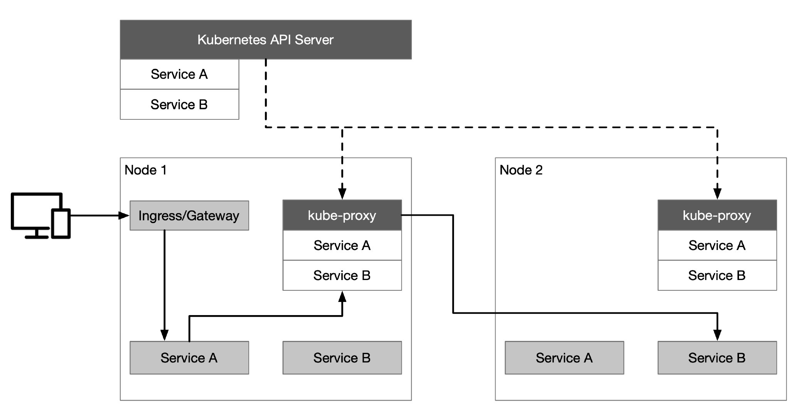
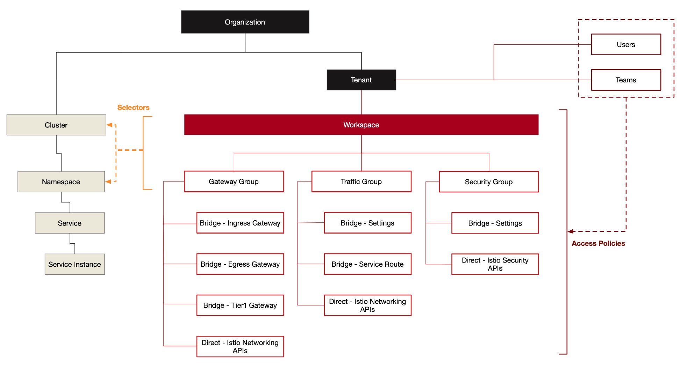
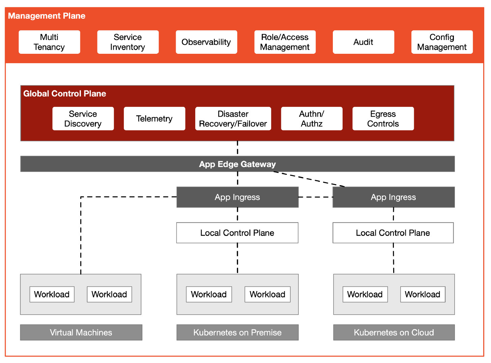

这篇文章将带你了解使用 Kubernetes 和 Istio Service Mesh 构建多集群及混合云的过程和需要考虑的问题。

## Kubernetes

使用 Kubernetes 可以快速部署一个分布式环境，实现了云的互操作性，统一了云上的控制平面。并提供了 Service、Ingress 和 [Gateway](https://kubernetes.io/blog/2021/04/22/evolving-kubernetes-networking-with-the-gateway-api/) 等资源对象来处理应用程序的流量。如下图所示，Kubernetes 中默认使用 Service 做服务注册和发现，服务之间可以使用服务名称来访问。Kubernetes API Server 与集群内的每个节点上的 `kube-proxy` 组件通信，为节点创建 iptables 规则，并将请求转发到其他 pod 上。

假定现在客户端要访问 Kubernetes 中的服务，首先请求会发送到 Ingress/Gateway 上，然后根据 Ingress/Gateway 里的路由配置转发到后端服务上（图中是服务 A），接着服务 A 对服务 B 请求的流量转发轮询到服务 B 的实例上。

## Kubernetes 多集群管理

多集群管理最常见的使用场景包括服务流量负载均衡、隔离开发和生产环境、解耦数据处理和数据存储、跨云备份和灾难恢复、灵活分配计算资源、跨区域服务的低延迟访问以及避免厂商锁定等。一个企业内部往往有多个 Kubernetes 集群，由 MultiCluster SIG 开发的 KubeFed 实现 Kubernetes 集群联邦可以实现多集群管理的功能，这使得所有 Kubernetes 集群都通过同一个接口来管理。

在使用集群联邦时需要解决以下几个通用问题：

- 配置需要联邦哪些集群
- 需要在集群中传播的 API 资源
- 配置 API 资源如何分配到不同的集群
- 对集群中 DNS 记录注册以实现跨集群的服务发现

下面是 KubeSphere 的多集群架构，也是最常用的一种 Kubernetes 多集群管理架构，其中 Host Cluster 作为控制平面，有两个成员集群，分别是 West 和 East。

Host 集群需要能够访问 Member 集群的 API Server，Member 集群之间的网络连通性没有要求。管理集群 Host Cluster 独立于其所管理的成员集群，Member Cluster 并不知道 Host Cluster 存在，这样做的好处是当控制平面发生故障时不会影响到成员集群，已经部署的负载仍然可以正常运行，不会受到影响。

Host 集群同时承担着 API 入口的作用，由 Host Cluster 将对 Member 集群的资源请求转发到 Member 集群，这样做的目的是方便聚合，而且也利于做统一的权限认证。我们看到在 Host Cluster 中有联邦控制平面，其中的 Push Reconciler 会将联邦集群中身份、角色及角色绑定传播到所有成员集群中。

## Istio

当我们在 Kubernetes 中运行着多语言、多版本的微服务，并需要更细粒度的金丝雀发布和统一的安全策略管理，实现服务间的可观察性时，可以考虑使用 Istio 服务网格。Istio 通过向应用程序 Pod 中注入 sidecar proxy，缺省使用 IPTables 透明得拦截进出应用程序的所有流量，从而实现了应用层到集群中其他启用服务网格的服务的智能应用感知负载均衡，并绕过了初级的 kube-proxy 负载均衡。Istio 控制平面与 Kubernetes API Server 通信可以获取集群中所有注册的服务信息。

下图展示了 Istio 的基本原理，其中所有节点属于同一个 Kubernetes 集群。

你可能最终会有至少几个Kubernetes集群，每个集群都承载着微服务。Istio 的多集群部署根据网络隔离、主备情况存在多种[部署模式](https://istio.io/latest/docs/setup/install/multicluster/)，可以使用 Istio Operator 部署时通过声明来指定。集群中的这些微服务之间的通信可以通过服务网格来加强。在集群内部，Istio提供通用的通信模式，以提高弹性、安全性和可观察性。

以上都是关于 Kubernetes 上的应用负载管理，但是对于虚拟机上遗留应用，如何在同一个平面中管理？如何管理多集群中的流量划分、网关和安全性呢？

## 管理平面

在 Istio 之上再增加一层抽象，将网关、流量和安全分组管理，并将它们应用到不同的集群和命名空间上。下图展示的是 [Tetrate Service Bridge](https://www.tetrate.io/tetrate-service-bridge/) 的多租户模型，利用 NGAC 来管理用户的访问权限，同时也有利于构建零信任网络。

Istio 提供了工作负载识别，并由强大的 mTLS 加密保护。这种零信任模型比基于源 IP 等拓扑信息来信任工作负载更好。在 Istio 之上构建一个多集群管理的通用控制平面，然后再增加一个管理平面来管理多集群，提供多租户、管理配置、可观察性等功能。

下图展示的是 Tetrate Service Bridge 的架构图。

## 总结

使用 Kubernetes 实现了异构集群的互操作性，Istio 将容器化负载和虚拟机负载纳入到一个同一个控制平面内，统一管理集群内的流量、安全和可观察性。但是，随着集群数量、网络环境和用户权限的越发复杂，人们还需要在 Istio 的控制平面至上再构建一层管理平面来进行混合云管理。
