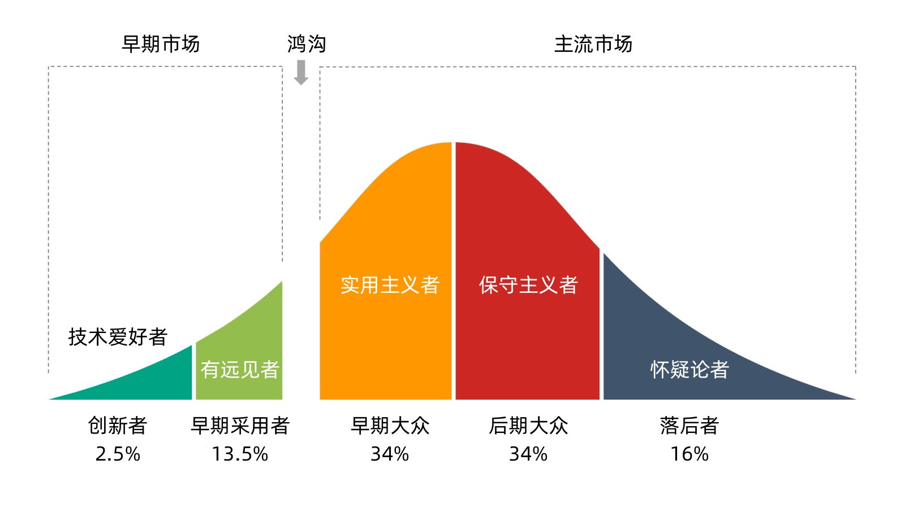
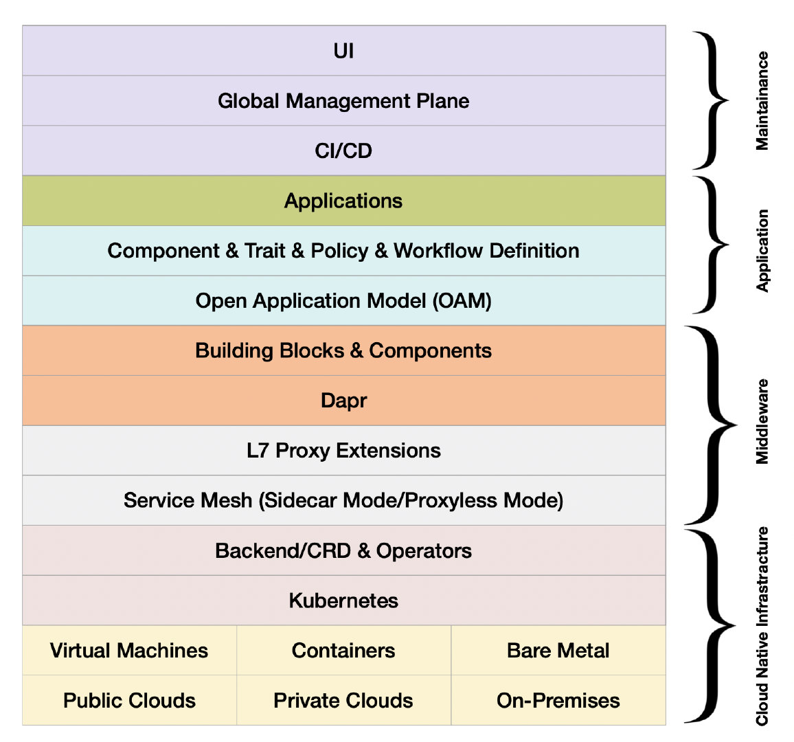
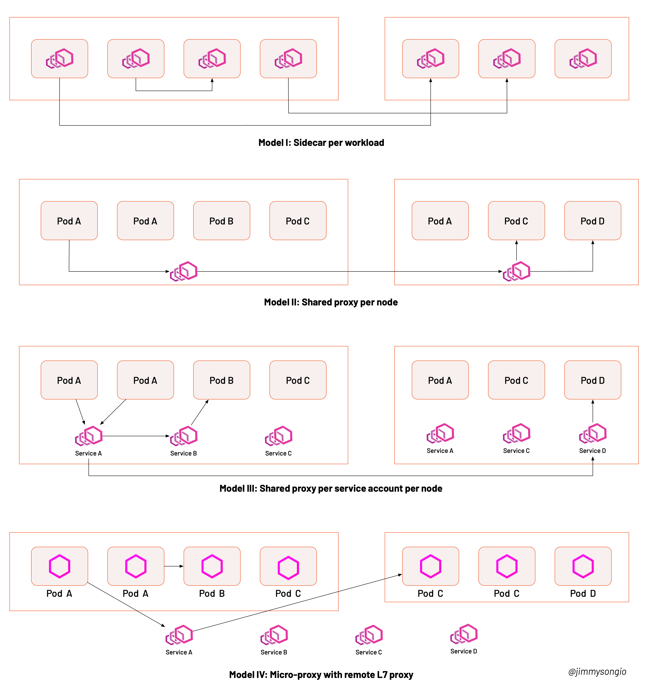

随着服务网格架构理念的深入人心，它的适用场景也慢慢为众人所了解，社区中也不乏争论，甚至是质疑的声音。笔者以在云原生和服务网格社区中多年的观察，将从亲历者的角度总结服务网格在 2021 年的进展。因为当前在国内 Istio 几乎是服务网格的代名词，本文也将主要从 Istio 的技术和生态层面来解读服务网格在 2021 年的发展。

## 服务网格：云原生的核心技术之一

作为 [CNCF 定义的云原生](https://github.com/cncf/toc/blob/main/DEFINITION.md)关键技术之一，服务网格发展至今已经有五个年头了，其发展经历了以下几个时期：

- 探索阶段：2017 年-2018 年
- 早期采用者阶段：2019 年-2020 年
- 大规模落地及生态发展阶段：2021 年至今

如果根据[“跨越鸿沟”理论](https://thinkinsights.net/strategy/crossing-the-chasm/)，服务网格已经跨越了“鸿沟”，处于“早期大众”和“晚期大众”阶段之间。根据[《Istio 大咖说》](https://cloudnative.to/sig-istio/big-talk/overview.html)观众中的反馈来看，用户已不再盲从于新技术，开始辩证的考虑[是否真的需要引入服务网格](https://cloudnative.to/sig-istio/begin/before-you-begin.html)。

 

云原生的发展方兴未艾，虽然不断有新的技术和产品出现，但作为整个云原生技术栈的一部分，服务网格在过去一年里不断夯实了它作为“云原生网络基础设施”的定位。下图展示了云原生技术栈模型，其中每一层有一些代表性的技术来定义标准。作为新时代的中间件，服务网格与其他云原生技术交相辉映，如 Dapr（分布式应用程序运行时）定义云原生中间件的能力模型，OAM 定义云原生应用程序模型等，而服务网格定义的是云原生七层网络模型。

 

图：云原生技术栈

## 社区焦点

过去一年中，社区的焦点主要集中在以下几个方面：

- **性能优化**：服务网格在大规模应用场景下的性能问题；
- **协议扩展**：让服务网格支持任意七层网络协议；
- **部署模式**：Proxyless vs Node 模式 vs Sidecar 模式；
- **引入 eBPF**：将服务网格的部分能力下沉到内核层；

### 性能优化

Istio 设计之初的目标就是通过“原协议转发”的方式服务于服务间流量，让服务网格尽可能对应用程序“透明”，从而使用了 [IPtables 劫持流量](https://jimmysong.io/blog/envoy-sidecar-injection-in-istio-service-mesh-deep-dive/)，根据[社区提供的测试结果](https://istio.io/latest/zh/blog/2019/performance-best-practices/)，对于在 16 个连接上具有 1000 RPS 的网格，Istio 1.2 仅增加了 3 毫秒的基准延迟。但是，因为 IPtables conntrack 模块所固有的问题，随着网格规模的扩大，Istio 的性能问题开始显现。关于 Istio sidecar 的资源占用及网络延迟的性能优化，社区给出了以下解决方案：

- Sidecar 配置：通过手动或在控制平面增加一个 Operator 的方式来配置服务的依赖项，可以减少向 Sidecar 中下发的服务配置数量，从而降低数据平面的资源占用；为了更加自动和智能地配置 Sidecar，开源项目 [Slime](https://cloudnative.to/blog/smart-istio-management-plane-slime/) 及 [Aeraki](https://github.com/aeraki-framework/aeraki) 都给出了各自的配置懒加载方案；
- 引入 eBPF：eBPF 可以作为优化服务网格性能的一种可行性方案，有基于 Cilium 的初创公司甚至激进的提出[使用 eBPF/Cilium 完全替换 Sidecar 代理](https://cloudnative.to/blog/ebpf-solve-service-mesh-sidecar/)的策略，但事实上 Envoy 代理/xDS 协议已经成为服务网格实现的实际代理，且很好的支持七层协议。eBPF 可用来改善网络性能，但复杂的协议协商、解析和用户扩展在用户侧依然很难实现。

### 协议扩展

如何扩展 Istio 一直以来就是一个老大难的问题。Istio 的可扩展包含两方面：

- 协议层面：让 Istio 支持所有七层协议
- 生态层面：让 Istio 可以运行更多的插件

Istio 使用的是 Envoy 作为数据平面，扩展 Istio 本质上就是对 Envoy 功能的扩展。Istio 官方目前给出的方案是使用 WebAssembly，并在[ Istio 1.12 引入 Wasm 插件配置 API 用于扩展 Istio 生态](https://cloudnative.to/blog/istio-wasm-extensions-and-ecosystem/)，Istio 的扩展机制使用 [Proxy-Wasm 应用二进制接口（ABI）](https://github.com/proxy-wasm/spec)规范，提供了一套代理无关的流媒体 API 和实用功能，可以用任何有合适 SDK 的语言来实现。截至目前，Proxy-Wasm 的 SDK 有 AssemblyScript（类似 TypeScript）、C++、Rust、Zig 和 Go（使用 TinyGo WebAssembly 系统接口）。

目前 WebAssembly 扩展应用还比较少，很多企业选择自定义 CRD，基于 Istio 构建服务网格管理平面。另外，让 Istio 支持异构环境，适用于一切工作负载，如虚拟机、容器，这个对于终端用户来说也有很强的需求，因为这可以让用户很方便的从传统负载迁移应用到服务网格中。最后是多集群、多网格的混合云流量管理，这个属于比较高阶的需求了。

### 部署模式

在服务网格概念兴起之初就有 Per-node 和 Sidecar 模式之争，他们的代表分别是 Linkerd 和 Istio。后来 eBPF 提出将服务网格下沉的内核，从而演化出了更多的服务网格部署模式，如下图所示。

 

图：服务网格的部署模式

下表中详细对比了这四种部署方式，它们各有优劣，具体选择哪种根据实际情况而定。

| **模式**                         | **内存开销**                                                 | **安全性**                                                   | **故障域**                                                   | **运维**                                                  |
| -------------------------------- | ------------------------------------------------------------ | ------------------------------------------------------------ | ------------------------------------------------------------ | --------------------------------------------------------- |
| **Sidecar 代理**                 | 因为为每个 pod 都注入一个代理，所以开销最大。                | 由于 sidecar 必须与工作负载一起部署，工作负载有可能绕过 sidecar。 | Pod 级别隔离，如果有代理出现故障，只影响到 Pod 中的工作负载。 | 可以单独升级某个工作负载的 sidecar 而不影响其他工作负载。 |
| **节点共享代理**                 | 每个节点上只有一个代理，为该节点上的所有工作负载所共享，开销小。 | 对加密内容和私钥的管理存在安全隐患。                         | 节点级别隔离，如果共享代理升级时出现版本冲突、配置冲突或扩展不兼容等问题，则可能会影响该节点上的所有工作负载。 | 不需要考虑注入 Sidecar 的问题。                           |
| **Service Account/节点共享代理** | 服务账户/身份下的所有工作负载都使用共享代理，开销小。        | 工作负载和代理之间的连接的认证及安全性无法保障。             | 节点和服务账号之间级别隔离，故障同“节点共享代理”。           | 同“节点共享代理”。                                        |
| **带有微代理的共享远程代理**     | 因为为每个 pod 都注入一个微代理，开销比较大。                | 微代理专门处理 mTLS，不负责 L7 路由，可以保障安全性。        | 当需要应用7层策略时，工作负载实例的流量会被重定向到L7代理上，若不需要，则可以直接绕过。该L7代理可以采用共享节点代理、每个服务账户代理，或者远程代理的方式运行。 | 同“Sidecar 代理”。                                        |

表：服务网格的部署模式

### 生态发展

2021 年，Istio 社区也是精彩纷呈，举办了系列的活动，还发布了系列教程：

- 2 月，首个 Istio 发行版，[ Tetrate Istio Distro（TID）](https://istio.tetratelabs.io/) 发布；
- 2 月，第一届 [IstioCon](https://events.istio.io/istiocon-2021/) 在线上举办，2000 多人参与了会议；
- 3 月，首个免费的线上 [Istio 基础教程](https://academy.tetrate.io/courses/istio-fundamentals-zh)发布；
- 5 月，首个 [Istio 管理员认证考试（CIAT）](https://academy.tetrate.io/courses/certified-istio-administrator)发布；
- 5 月，ServiceMeshCon Europe 在线上举办；
- 7 月，[Istio Meetup China](https://istio.io/latest/zh/blog/2021/istiomeetups-china/) 在北京举办，100 多人现场参加；
- 10 月，ServiceMeshCon North America 在洛杉矶举办；

此外还有众多与 Istio 服务网格相关的项目开源，如下表所示。

| **项目名称**                                                 | **开源时间**  | **类别** | **描述**                                               | **主导公司** | **Star 数量** | **与 Istio 的关系**                           |
| ------------------------------------------------------------ | ------------- | -------- | ------------------------------------------------------ | ------------ | ------------- | --------------------------------------------- |
| [Envoy](https://github.com/envoyproxy/envoy)                 | 2016年 9 月   | 网络代理 | 云原生高性能边缘/中间服务代理                          | Lyft         | 18700         | 默认的数据平面                                |
| [Istio](https://github.com/istio/istio/)                     | 2017 年 5 月  | 服务网格 | 连接、保护、控制和观察服务。                           | Google       | 29100         | 控制平面                                      |
| [Linkerd2](https://github.com/linkerd/linkerd2)              | 2017 年 12 月 | 服务网格 | 适用于 Kubernetes 的轻量级服务网格。                   | Buoyant      | 7900          | 服务网格的另一种实现                          |
| [Emissary Gateway](https://github.com/emissary-ingress/emissary) | 2018 年 2 月  | 网关     | 用于微服务的 Kubernetes 原生 API 网关，基于 Envoy 构建 | Ambassador   | 3600          | 可连接 Istio                                  |
| [APISIX](https://github.com/apache/apisix)                   | 2019 年 6 月  | 网关     | 云原生 API 网关                                        | API7         | 8100          | 可作为 Istio 的数据平面运行也可以单独作为网关 |
| [MOSN](https://github.com/mosn/mosn)                         | 2019 年 12 月 | 代理     | 云原生边缘网关及代理                                   | 蚂蚁         | 3500          | 可作为 Istio 数据平面                         |
| [Slime](https://github.com/slime-io/slime)                   | 2021 年 1月   | 扩展     | 基于 Istio 的智能服务网格管理器                        | 网易         | 236           | 为 Istio 增加一个管理平面                     |
| [Tetrate Istio Distro](https://github.com/tetratelabs/getmesh) | 2021 年 2 月  | 工具     | Istio 集成和命令行管理工具                             | Tetrate      | 95            | 第一个 Istio 开源发行版和多版本管理工具       |
| [Aeraki](https://github.com/aeraki-framework/aeraki)         | 2021 年 3 月  | 扩展     | 管理 Istio 的任何七层负载                              | 腾讯         | 330           | 扩展多协议支持                                |
| [Layotto](https://github.com/mosn/layotto/)                  | 2021 年 6 月  | 运行时   | 云原生应用运行时                                       | 蚂蚁         | 393           | 可以作为 Istio 的数据平面                     |
| [Hango Gateway](https://github.com/hango-io/hango-gateway)   | 2021 年 8 月  | 网关     | 基于 Envoy 和 Istio 构建的 API 网关                    | 网易         | 253           | 可与 Istio 集成                               |

注：数据统计截止到 2022 年 1 月 6 日。

## 总结

回望 2021 年，我们可以看出用户对服务网格的追求更趋实用，作为云原生网络的基础设施，其地位得到进一步夯实，更重要的是服务网格生态渐起。展望 2022 年，有两个值得关注的技术是 eBPF 和 WebAssembly。我们有理由相信，更多的服务网格实践优秀案例出现，在生态和标准化上更进一步。

## 参考

- [告别 Sidecar——使用 eBPF 解锁内核级服务网格](https://cloudnative.to/blog/ebpf-solve-service-mesh-sidecar/)
- [网易开源 Istio 扩展项目 Slime 简介——基于 Istio 的智能服务网格管理器](https://cloudnative.to/blog/smart-istio-management-plane-slime/)
- [Istio 1.12 引入 Wasm 插件配置 API 用于扩展 Istio 生态](https://cloudnative.to/blog/istio-wasm-extensions-and-ecosystem/)
- [基于 GRPC 和 Istio 的无 Sidecar 代理的服务网格](https://cloudnative.to/blog/grpc-proxyless-service-mesh/)
- [eBPF 如何简化服务网格](https://cloudnative.to/blog/how-ebpf-streamlines-the-service-mesh/)
- [使用 Isito 前的考虑要素](https://cloudnative.to/sig-istio/begin/before-you-begin.html)
