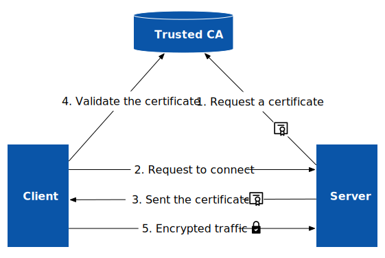

Istio 服务网格可以帮助云原生应用实现自动 mTLS，完成网格内的流量加密，有助于缩小云原生部署的攻击面，是构建零信任应用网络的关键框架。为了理解 Istio 中的 mTLS 流量加密，本文将包括以下内容：

- 介绍什么是 TLS、mTLS 和 TLS 终止
- 介绍 Istio 中如何实现 TLS 加密
- 如何使用 Istio 为 Kubernetes 中的服务实现 mTLS？
- 何时需要 mTLS？合适不需要 mTLS？

## 什么是 TLS 和 mTLS？{#what-is-tls-and-mtls}

TLS（Transport Layer Security，传输层安全性）是一种广泛采用的安全协议，用于在联网计算机之间建立经过身份验证和加密的链接，旨在促进互联网通信的私密性和数据安全性。TLS 作为 [SSL](https://www.ssl.com/faqs/faq-what-is-ssl/)（Secure Socket Layer，安全套接字层）的继任者，实际上是由 SSL 改名而来，因此人们经常将 TLS/SSL 混用，在本文中我们将统称为 TLS。 TLS 1.0 发布于 1999 年，最新版本为 1.3（发布于 2018 年 8 月），1.0 和 1.1 版本已弃用。

我们在浏览网页时看到的 HTTPS 实际上就使用了 TLS，如下图所示。TLS 是建立在 TCP 之上的，作为 OSI 模型中的会话层。为了保证兼容性，TLS 通常使用 443 端口，但是你也可以使用任意端口。


当客户端需要验证服务端身份，以防中间人攻击同时保证通信安全的情况下，在和服务端通信时会要求 TLS 加密。下图展示了的是 TLS 加密通信的流程。



1. 服务器向受信任的 CA（证书管理机构）申请并获得证书（X.509 证书）；
2. 客户端向服务端发起请求，其中包含客户端支持的 TLS 版本和密码组合等信息；
3. 服务器回应客户端请求并附上数字证书；
4. 客户端验证证书的状态、有效期和数字签名等信息，确认服务器的身份；
5. 客户端和服务器使用共享秘钥实现加密通信；

以上仅是对 TLS 通信流程的一个概要描述，实际的 TLS 握手过程比较复杂，请参考[这篇文档](https://www.cloudflare.com/learning/ssl/what-happens-in-a-tls-handshake/)。

从以上过程中你会发现，证书是代表服务器身份的关键要素，对于互联网公开服务，服务器需要使用权威认证的 CA 颁发的证书，而对于私有环境内部的服务，可以使用 PKI（Private Key Infrastructure，私钥基础设施）来管理证书。

双向 TLS 或相互 TLS（Mutual TLS 或 mTLS）是指在服务端和客户端之间使用双向加密通道，需要双方相互提供证书并验证对方身份。关于如何在 Kubernetes 中使用 mTLS 请参考[这篇文章](https://lib.jimmysong.io/blog/mtls-guide/)。关于 mTLS 的详细介绍请见[这篇文章](https://www.cloudflare.com/zh-cn/learning/access-management/what-is-mutual-tls/)。

## 什么是 TLS 终止？{#what-is-tls-termination}

TLS 终止（TLS Termination）指的是在将 TLS 加密流量传递给 Web 服务器之前对其进行解密的过程。将 TLS 流量卸载到入口网关或专用设备上，可以提高 Web 应用的性能，同时确保加密流量的安全性。一般运行在集群入口处，当流量到达入口处时实施 TLS 终止，入口与集群内服务器之间的通信将直接使用 HTTP 明文，这样可以提高服务性能。


Istio 默认在入口网关处终止 TLS，然后再为网格内的服务开启 mTLS。你也可以让流量直通（passthrough）到后端服务处理，例如：

```yaml
apiVersion: networking.istio.io/v1beta1
kind: Gateway
metadata:
  name: sample-gateway
spec:
  servers:
  - port:
      number: 443
      name: https
      protocol: HTTPS
    tls:
      mode: PASSTHROUGH
```

详见[网关 TLS  配置](https://istio.io/latest/zh/docs/ops/configuration/traffic-management/tls-configuration/#gateways)。

## Istio 中如何实现自动 mTLS？{#istio-mtls}

下图中展示的是 Istio 安全架构图，从图中可以看到在入口处使用 JWS + TLS 认证和加密，在 Istio 网格内部的所有服务间都开启了 mTLS。


Istio 中内置了 CA，使用 xDS 中的 SDS（Secret Discovery Service，秘密发现服务）实现 SVID 证书的签发和轮换。Istio 网格内的 mTLS 流程如下：

1. Sidecar 代替工作负载向 Istiod 申请证书，Istiod 签发 [SVID](https://lib.jimmysong.io/kubernetes-handbook/auth/spiffe/#svid) 证书（该过程比较复杂，我将在今后的博客中说明）；
2. 客户端请求被 Pod 内的 sidecar 拦截；
3. 客户端 sidecar 与服务端 sidecar 开始 mTLS 握手。在握手的同时，客户端 sidecar 中的 JWT 和认证过滤器将对请求的身份进行认证，认证通过后将身份存储在过滤器元数据中，然后请求经过授权过滤器，判断请求权限。
4. 若请求通过了认证与授权，则客户端和服务端开始建立连接进行通信。

Istio 中有三个资源对象可用于配置服务间的认证与授权：

- `RequestAuthentication`：用于定义服务支持的请求级认证方式，目前只支持  JWT；
- `PeerAuthentication`：配置服务间的传输认证模式，如 `STRICT`、`PERMISSIVE` 或 `DISABLE` 等，以开启 mTLS 或明文请求；
- `AuthorizationPolicy`：用于授权服务间的流量，定义谁可以做什么？例如主体 A 允许（`ALLOW`）或拒绝（`DENY`）来自主体 B 的流量；

## 如何使用 Istio 为服务开启自动 mTLS？ {#how-to-setup-mtls}

你可以在 `PeerAuthentication` 中指定对目标工作负载实施的 mTLS 模式。对等认证支持以下模式：

- `PERMISSIVE`：默认值，工作负载可接受双向 TLS 或纯文本流量；
- `STRICT`：工作负载仅接受 mTLS 流量；
- `DISABLE`：禁用 mTLS。从安全角度来看，除非你有自己的安全解决方案，否则不应禁用 mTLS；
- `UNSET`：从父级继承，优先级为服务特定 > 命名空间范围 > 网格范围的设置；

Istio 的对等认证默认使用 `PERMISSIVE` 模式，自动将 mTLS 流量发送到这些工作负载，将纯文本流量发送到没有 sidecar 的工作负载。在将 Kubernetes 服务纳入 Istio 网格后，为了防止服务无法通过 mTLS，我们可以先使用 `PERMISSIVE` 模式。当我想为某些服务开启严格的 mTLS 模式时，可以使用以下两种方式之一：

- 使用 `PeerAuthentication` 定义流量如何在 sidecar 之间传输；
- 使用 `DestinationRule` 定义流量路由策略中的 TLS 设置；

下面以为 `default` 命名空间下的 `reviews` 服务设置 mTLS 为例说明。

### 使用 PeerAuthentication 为工作负载设置 mTLS {#peerauthentication-tls-setting}

你可以使用 `namespace` 和 `selector` 指定某个命名空间下的某个工作负载开启严格的 mTLS。例如下面的配置：

```yaml
apiVersion: security.istio.io/v1beta1
kind: PeerAuthentication
metadata:
  name: foo-peer-policy
  namespace: default
spec:
  selector:
    matchLabels:
      app: reviews
  mtls:
    mode: STRICT
```

你也可以给安装 Istio  的命名空间 `istio-system` 设置严格的 mTLS，那样会为网格中的所有服务开启严格的 mTLS，详细步骤请参考 [Istio 文档](https://istio.io/latest/zh/docs/tasks/security/authentication/mtls-migration/)。

### 使用 DestinationRule 为工作负载设置 mTLS {#destinationrule-tls-setting}

DestinationRule 用于设置流量路由策略，例如负载均衡、异常点检测、TLS 设置等。其中 TLS 设置中包含[多种模式](https://istio.io/latest/docs/reference/config/networking/destination-rule/#ClientTLSSettings-TLSmode)，使用 `ISTIO_MUTUAL` 模式可以为工作负载开启 Istio 的自动 TLS，如下所示。

```yaml
apiVersion: networking.istio.io/v1beta1
kind: DestinationRule
metadata:
  name: reviews
  namespace: default
spec:
  host: reviews
  trafficPolicy:
    tls:
      mode: ISTIO_MUTUAL
```

## 什么时候用 mTLS？{#when-use-mtls}

互联网客户端对 Web 服务的访问，一般使用单向 TLS，即只需要服务端提供身份证明，而不关心客户端的身份。当你需要验证客户端身份时，使用单向 TLS可以使用密码、token、双因子认证等方式。不过这样的认证方式需要应用程序内部支持，而双向 TLS 是运行在应用程序之外的，不需要多应用逻辑进行修改。

当你需要正如你在上文中看到的，实施 mTLS 的服务间需要交换证书，当服务数量变大时，就需要管理大量的证书，这需要消耗大量的精力，使用服务网格可以帮助你实现自动 mTLS，彻底解决证书管理的难题。

### 什么时候不用 mTLS？{#when-not-use-mtls}

虽然 mTLS 是确保云原生应用程序服务间通信安全的首选协议，但是应用 mTLS 需要完成复杂的对称加密、解密过程，这将非常耗时且消耗大量的 CPU 资源。对于某些安全级别不高的流量，如果我们在流量入口处终止 TLS，并网格内部仅对针对性的服务开启 mTLS，就可以加快请求响应和减少计算资源消耗。

另外当有的服务无法获取证书，例如 Kubelet 上使用 HTTP 的健康检查，无法通过 TLS 访问服务内的健康检查端点，这时候就需要[为 Pod 禁用探针重写](https://istio.io/latest/zh/docs/ops/configuration/mesh/app-health-check/#disable-the-http-probe-rewrite-for-a-pod)。

最后当网格中的服务访问一些外部服务时，也不需要 mTLS。

## 总结 {#summary}

mTLS 实现了网格内流量的加密，是构建零信任应用网络的关键一步。借助 Istio 我们可以很方便的为 Kubernetes 中的服务开启自动 mTLS，省去管理证书的麻烦。同时，我们也可以针对性的为网格内的部分服务开启 mTLS，便于我们将 Kubernetes 中的服务迁移到网格内。关于 Istio 中的证书管理，我们将在今后的博客中再做说明。

## 参考 {#reference}

- [什么是 TLS（传输层安全性）？- cloudflare.com](https://www.cloudflare.com/zh-cn/learning/ssl/transport-layer-security-tls/)
- [什么是相互 TLS（mTLS）？- cloudflare.com](https://www.cloudflare.com/zh-cn/learning/access-management/what-is-mutual-tls/)
- [What happens in a TLS handshake? | SSL handshake - cloudflare.com](https://www.cloudflare.com/learning/ssl/what-happens-in-a-tls-handshake/)
- [写给 Kubernetes 工程师的 mTLS 指南 - lib.jimmysong.io](https://lib.jimmysong.io/blog/mtls-guide/)
- [云原生安全白皮书中文版 - github.com](https://github.com/cncf/tag-security/blob/main/security-whitepaper/v1/cloud-native-security-whitepaper-simplified-chinese.md)
- [Istio 安全 - istio.io](https://istio.io/latest/zh/docs/concepts/security/)
