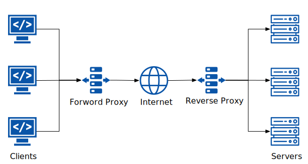

在 Istio 最新的 Ambient 模式中，使用了 tproxy 做透明流量劫持（[见此博客](/blog/ambient-mesh-l4-traffic-path/)），这与 Sidecar 模式中基于 IPtables 的流量劫持方式有些许不同，这篇文文章，我们就就一起来探究下什么是 tproxy。

## 什么是代理？{#what-is-proxy}

在介绍透明代理之前，我们先了解下什么是代理。

### 代理的功能 {#proxy-functionalities}

代理在互联网中的用途非常广泛，例如：

- 缓存请求：加快网络响应速度，作用类似于 CDN；
- 请求过滤：用于网络监管，屏蔽或允许对某些主机、网站的访问；
- 请求转发：用于负载均衡或作为网络中继；
- 流量管理：对进出代理的流量进行细粒度的管理，例如按百分比发布到不同的后端、超时和重试设置、熔断等；
- 安全审计：记录和限制客户端请求，用于计费或审计；

### 代理的分类 {#proxies-types}

代理的分类方式有很多，下图根据代理的位置将其划分为了两类：

- 前向代理（Forward Proxy）：运行在客户端侧，代替客户端想服务端发送请求，例如我们日常使用的各种科学上网代理；
- 反向代理（Reverse Proxy）：代替服务端接受互联网或外部请求，然后将请求路由到对应的服务端，例如各种 Web 服务器，[在这里](https://jimmysong.io/awesome-cloud-native/#proxy)你可以看到一个代理列表；

代理可能与客户端或服务器位于同一节点（或网络空间，如 Kubernetes 中的 Pod），也可以位于远端。另外还可以根据代理对客户端或服务端是否可见（visible）来分为透明代理和非透明代理。下图展示了客户端（A）通过代理（B）向服务端（C）发送请求的过程。

- 非透明代理：客户端需要修改目的地址为代理服务器的地址，并使用代理协议连接代理服务器；
- 透明代理：所谓透明代理，即客户端和服务端感知不到代理的存在，客户端无需修改目的地址，也不需要采用代理协议连接代理服务器，所有目的地址转换都是在透明代理中完成的；

## 使用 tproxy 透明代理 {#how-to-use-tproxy}

`tproxy` 是 Linux 的内核模块（自 Linux 2.2 版本开始引入），用于实现透明代理，其名称中的字母 `t` 即代表透明（transparent）。

要使用透明代理首先需要把指定的数据包使用 iptables 拦截到指定的网卡上，然后在该网卡监听并转发数据包。

使用 `tproxy` 实现透明代理的步骤如下：

1. 首先需要实现流量拦截：在 iptables 的 `PREROUTING` 链的 `mangle` 表中创建一个规则，拦截流量发送给 tproxy 处理，例如 `iptables -t mangle -A PREROUTING -p tcp -dport 9080 -j TPROXY --on-port 15001 --on-ip 127.0.0.1 --tproxy-mark 0x1/0x1`，给所有目的地为 `9080` 端口的 TCP 数据包打上标记 `1`，你还可以指定来源 IP 地址或者 [IP 集](https://ipset.netfilter.org/)，进一步缩小标记范围，tproxy 监听在 `15001` 端口；
2. 创建一个路由规则，将所有带有标记 `1` 的数据包查找特定的路由表：例如 `ip rule add fwmark 1 lookup 100`，让所有 `fwmark` 为 1 的数据包查找 `100` 路由表；
3. 将数据包映射到特定的本地地址：例如 `ip rule add local 0.0.0.0/0 dev lo table 100`，在 `100` 路由表中将所有 IPv4 地址声明为本地，当然这只是一个例子，实际使用时需要请将特定的 IP 的数据包转发到本地的 `lo` 回环网卡；
4. 至此流量已被拦截到 tproxy 的监听端口 `15001`（从 Linux 内核空间进入用户空间），你可以编写网络应用处理数据包或使用 [Squid](http://www.squid-cache.org/) 或 [Envoy](https://www.envoyproxy.io/) 等支持 tproxy 的软件来处理数据包；

## 透明代理的优点 {#pros}

透明代理具有以下优点：

- 透明代理提供更高的带宽并减少传输延迟，从而提高服务质量；
- 用户无需配置网络和主机；
- 企业可以控制对其网络服务的访问；

- 用户可以通过透明代理连接互联网以绕过一些监管；

## 透明代理的缺点 {#cons}

透明代理有以下缺点：

- 如果透明代理配置不当，可能导致用户无法连接互联网，而对于不知情的用户来说，他们无法排查和修改透明代理中的错误；
- 透明代理的安全性无法得到保证，因为被拦截的用户流量可能被透明代理篡改；
- 透明代理可能缓存用户信息，导致用户隐私泄露的风险；

## 总结 {#summary}

透明代理作为代理中的一类重要类型，它的用途广泛，不论是 xray、clash 等代理软件，还是 Istio 服务网格中得使用了应用。了解它的原理和工作方式有助于我们科学正确的使用代理，而是否使用透明代理取决于你对它的信任和了解程度。

## 参考 {#reference}

- [tproxy-example - github.com](https://github.com/kristrev/tproxy-example)
- [Linux transparent proxy support - powerdns.org](https://powerdns.org/tproxydoc/tproxy.md.html)
- [Feature: TPROXY version 4.1+ Support - wiki.squid-cache.org](https://wiki.squid-cache.org/Features/Tproxy4)
