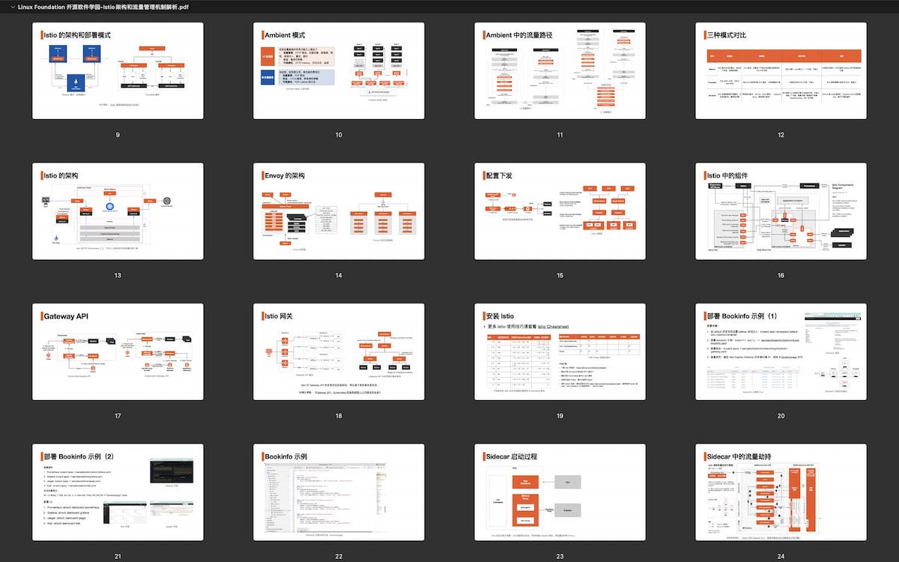

这篇文章是根据笔者在 Linux Foundation APAC“源来如此” [开源软件学园技术公开课](https://mp.weixin.qq.com/s/LSnr7R4ZqCqnr1veOq11nQ)《Istio 架构与流量管理机制解析》分享内容整理而成。

- 本次分享的幻灯片可以[在腾讯文档中观看](https://docs.qq.com/pdf/DRUZTVXZCS25QTlZy)。

- 在 [B 站](https://www.bilibili.com/video/BV1YG4y1t7kh)中观看直播回放。



## 前言

Istio 自 2017 年开源，至今已有 5 年多时间，业界已经出版了很多本介绍 Istio 的图书，包括笔者参与编写的《深入理解 Istio》，网上也有很多教程和文章介绍 Istio 配置的用法，但是笔者觉得都还不够生动形象，本文将发挥互联网多媒体的优势，笔者整理了以前撰写的介绍 Istio 的文章及绘制的图片，同时结合 Istio 的最新进展，重新撰写一篇介绍 Istio 架构和基础的流量管理功能的文章。读者可以跟着我一起来动手体验，一步步深入了解 Istio。

本次分享内容包括：

- Istio 的架构与部署模式：Sidecar、Proxyless 和 Ambient 模式解析
- Istio 中的流量管理机制及资源对象介绍
- Istio 部署与安装示例
- Istio 中的流量拦截与路由过程详解

## 准备条件

为了能够自己动手实验，你需要准备：

- Kubernetes 集群 1.21+
- Istio 1.15
- Kubectl
- Lens（我推荐的一个 Kubernetes UI）

## Istio 的架构

下面我就以 Istio 官方 task [Requst routing](https://istio.io/latest/docs/tasks/traffic-management/request-routing/) 中的例子来说明，sidecar 模式下 VirtualService 是如何运作的。

我们先简要描述下这个例子在开始前的 Istio Mesh 状态：

1. 安装好 Istio，并为 `default` namespace 开启了自动 sidecar 注入；
2. 在 `default` namespace 下安装了 bookinfo 示例，Bookinfo 示例中的 Kubernetes Service 会自动注册到 Istio Mesh 的 Cluster 中，例如 `outbound|9080||details.default.svc.cluster.local`，注意在其中没有 `subset` 信息；
3. 创建了一系列的 Istio CR，包括：
   1. Gateway ： `bookinfo-gateway` 用于选择 Istio 的 Ingress Gateway，作为 bookinfo 的对外流量入口；
   2. DestinationRule：`productpage`、`reviews`、`ratings`、`details` 将这些流量路径通过 `subset` 与 Kubernetes 的 Service 关联起来，将用于未来的分版本路由。实际上为了让 Bookinfo 可以运行起来，这些 DestinationRule 目前都是不必要的；但是你创建了这些 DestinationRule 之后，就会在 Istio Mesh 中创建新的 Cluster 配置，比如 `outbound|9080|v1|reviews.default.svc.cluster.local` 这些 `dynamic_active_clusters `，在创建 VirtualService 指定路由的时候，Istiod 就会下发 `dynamic_route_configs` 给 sidecar，其中会包含 `reviews.default.svc.cluster.local:9080` 路由，其中指定了将路由到的 cluster，这个 cluster 就是在 VirtualService 中配置的那个 host 的 `subset`；
   3. VirtualService：`bookinfo` 指定了流量在通过 `bookinfo-gateway` 进入 Istio Mesh 之后怎么走，其中指定了 URI 匹配的目的地是 `productpage`，请注意这里的 `productpage` 对应的是 Kubernetes 中的 Service。

要想实现在 bookinfo 示例的网页中每次刷新显示的书籍评分都显示星级，只需要创建并应用如下的 VirtualService 即可：

```yaml
apiVersion: networking.istio.io/v1alpha3
kind: VirtualService
metadata:
  name: reviews
spec:
  hosts:
  - reviews
  http:
  - route:
    - destination:
        host: reviews
        subset: v1
```

下面是部署了 VirtualService 之后 Istio 网格背后发生的事情。 

### 步骤一：流量拦截

当你为某个 namespace 开启了 sidecar 自动注入或者手动向 Deployment 的 pod 中注入了 sidecar，进出该 pod 的 TCP 服务流量经过 iptables 拦截到 Envoy 的 15006 端口，详细过程请见[Istio 中的 Sidecar 注入、透明流量劫持及流量路由过程详解](https://jimmysong.io/blog/sidecar-injection-iptables-and-traffic-routing/)。

### 步骤二：配置下发

你使用 kubectl 应用了 YAML 配置到 Istio Mesh，默认情况下，Istiod 使用 xDS 将配置下发到所有 namespace 下的 pod 中，除非你为 VirtualService 配置了 `exportTo` 字段。这些配置被应用到 pod 内的 Envoy 上，你可以用执行下面的命令查看某个 pod 中的 Envoy 的当前配置：

```bash
kubectl -n default port-forward deploy/productpage-v1 15000
```

然后在浏览器中打开 `http://localhost:15000` 就可以进入 Envoy 的 admin 页面，查看 Envoy 的当前配置。在应用新的 VirtualService 之前，你可以保存当前 Envoy 的配置，然后应用后的 Envoy 配置做对比。关于 sidecar 中各个端口的详细用法请见[Istio 中的各组件端口及功能详解](https://jimmysong.io/blog/istio-components-and-ports/)。

### 步骤三：Envoy 处理流量

被拦截的流量在进入 Pod 的 Envoy Inbound Handler 后，然后进入 Envoy 的 Filter Chain，对于 HTTP 流量会进入 HttpConnectionManager（HCM）这个高级网络过滤器链，这里面有一系列的 HTTP 过滤器。Productpage 页面对 reviews 服务的访问究竟走哪个 subset，还得看 `prodcutpage` pod 中的 Envoy 配置。在步骤二的那个页面上查看 `config_dump`，你将看到 Envoy 的详细配置，其中的 `dynamic_route_configs` 中，可以看到对 `reviews.default.svc.cluster.local:9080` 服务的 Route 配置是 `outbound|9080|v2|reviews.default.svc.cluster.local` Cluster，再查看这个 Cluster 的配置，可以看到是用 EDS 来获取的，你可以使用 `istioctl proxy-config endpoint xxx` 查看该 pod 上可识别的所有 Endpoint。

关于详细流程请参考[分享的幻灯片](https://docs.qq.com/pdf/DRUZTVXZCS25QTlZy)及演示视频。

## 更多资源

归根结底，在 Istio 网格中是 Envoy 处理的七层流量，要想了解更底层的原理，需要对 Envoy 有更详细的了解。推荐大家学习 Envoy 基础教程，还有下面这些学习资源：

- [Tetrate 学院](http://academy.tetrate.io)

- - [Istio 基础教程](https://academy.tetrate.io/courses/istio-fundamentals-zh)
  - [Envoy 基础教程](https://academy.tetrate.io/courses/envoy-fundamentals-zh)

- 云原生资料库：[lib.jimmysong.io](http://lib.jimmysong.io)

- 云原生社区：[cloudnative.to](http://cloudnative.to)

- [Istio 管理员认证](https://academy.tetrate.io/courses/certified-istio-administrator)

## 关于

“源来如此”是由 Linux 基金会开源软件学园主办的开源技术公开课系列活动。Linux 基金会开源软件学园是 Linux 基金会中国区官方培训平台，致力于为中国软件行业培养具备专业开源技能的人才，不仅为中国开发者提供来自源头的开源技术课程，更发挥 Linux 基金会开源领导能力，积极与国内权威技术专家、知名软件企业合作，开展开源技术公开课系列活动，让更多人了解开源知识，以开源技术公开课为窗口了解开源世界。

Linux Foundation 开源软件学园（LFOSSA）依托于全球最大的开源软件组织，是领先全球的高端专业软件人才教育机构，为科技企业培养了大量软件人才，Linux 基金会开源软件学园不仅拥有丰富的线上专业课程，面授课程的导师同样是由业内资深专家担任，所颁发的证书更是全球认可的专业资质。Linux 基金会做为非牟利国际技术组织，致力于通过开源推动创新和促进科技发展，我们唯一的目标就是帮助您的事业发展更上一层楼。